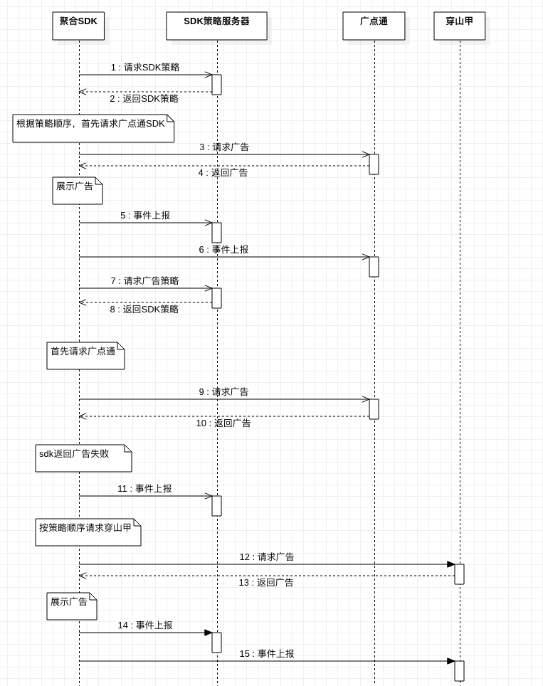

# AdvanceSDK对接文档-Android

版本号：v3.1.2

本文档为聚合sdk接入配置文档。用户可以参考[AdvanceSdkDemo](http://www.bayescom.com/download/sdk.php?sdk=advance_android)工程中的配置以及广告位接入代码进行开发。

目前聚合SDK支持管理的广告位类型为：

- 横幅广告位(Banner)： 广点通Banner2.0类型，穿山甲模板类型，Mercury

- 开屏广告位(Splash)：广点通，穿山甲，Mercury

- 插屏广告位（Interstitial)：广点通插屏2.0类型，穿山甲模板类型，Mercury

- 原生模板信息流广告位(NativeExpress): 广点通，穿山甲模板类型,Mercury

- 激励视频(RewardVideo)：广点通，穿山甲模板类型,Mercury

- 全屏视频(FullScreenVideo)：广点通，穿山甲

  

## 1.聚合SDK工作流程




## 1.SDK包导入

在工程中创建一个libs目录，拷贝集成SDK需要的库文件(请使用提供的sdk包保证版本一致)：

advancelib_3.1.0.aar(聚合SDK包)

mercurysdk_3.1.1.aar  （mercurySDK 集成后apk增加约500k）

GDTSDK.unionNormal.4.174.1044.aar   （广点通SDK 集成后apk增加约2000k）

open_ad_sdk.aar （穿山甲SDK v2.8.0.1 集成后apk增加约1700k）


在工程的build.gradle中引入这些库，具体配置可以参考AdvanceSdkDemo工程的build.gradle设置。

```groovy
repositories {
    flatDir {
        dirs 'libs'
    }
}
    implementation(name: 'advancelib_3.1.0', ext: 'aar')
    implementation(name: 'open_ad_sdk', ext: 'aar')
    implementation(name: 'GDTSDK.unionNormal.4.174.1044', ext: 'aar')
    implementation(name: 'mercurysdk_3.1.1', ext: 'aar')
```

```
为了适配穿山甲SDK下载和安装相关功能，在工程中引用的包 com.android.support:support-v4:24.2.0 
使用24.2.0以及以上版本。
```

目前SDK支持Android 4.0 以及以上系统的 Android 设备。

## 2.SDK相关权限申请

要保证SDK能够正常工作需要申请必要的权限，如果targetSdkVersion>23还需要动态申请相关权限，具体实现可参见Demo工程 SplashActivity.java。

```Xml
<uses-permission android:name="android.permission.INTERNET" />
<uses-permission android:name="android.permission.ACCESS_NETWORK_STATE" />
<uses-permission android:name="android.permission.ACCESS_WIFI_STATE" />
<uses-permission android:name="android.permission.READ_PHONE_STATE" />
<uses-permission android:name="android.permission.ACCESS_COARSE_LOCATION" />
<uses-permission android:name="android.permission.ACCESS_FINE_LOCATION" />    <!-- 如果需要精确定位的话请加上此权限 -->
<uses-permission android:name="android.permission.WRITE_EXTERNAL_STORAGE" />
<uses-permission android:name="android.permission.REQUEST_INSTALL_PACKAGES" />
<!--穿山甲相关-->
<uses-permission android:name="android.permission.GET_TASKS"/>
<!-- 如果有视频相关的广告且使用textureView播放，请务必添加，否则黑屏 -->
<uses-permission android:name="android.permission.WAKE_LOCK" />

```

## 3.AndroidManifest.xml配置

如果您打包 App 时的 targetSdkVersion >= 28：在AndroidManifest.xml 添加依赖声明 `uses-library android:name="org.apache.http.legacy" android:required="false"`
在application标签中添加 `android:usesCleartextTraffic="true"`，否则 SDK 无法工作，示例如下：

```xml
<application
    android:name=".DemoApplication"
    android:icon="@drawable/gdticon"
    android:label="@string/app_name"
    android:theme="@style/AppTheme"
    android:usesCleartextTraffic="true">

    <uses-library
        android:name="org.apache.http.legacy"
        android:required="false" />
    ... ...
  </application>
```

在AndroidManifest.xml中注册SDK相关的Activity和Service:

```xml
<!--广点通-->
<service 
    android:name="com.qq.e.comm.DownloadService" 
    android:exported="false" />
<activity 
    android:name="com.qq.e.ads.ADActivity" 
    android:configChanges="keyboard|keyboardHidden|orientation|screenSize" />
<activity 
    android:name="com.qq.e.ads.PortraitADActivity" 
    android:screenOrientation="portrait" 
    android:configChanges="keyboard|keyboardHidden|orientation|screenSize" />
<activity 
    android:name="com.qq.e.ads.LandscapeADActivity" 
    android:screenOrientation="landscape" 
    android:configChanges="keyboard|keyboardHidden|orientation|screenSize" />


```

针对Andriod7.0以上文件访问兼容性配置，在AndroidManifest.xml中增加：

```xml
<!--穿山甲-->
<provider
    android:name="com.bytedance.sdk.openadsdk.TTFileProvider"
    android:authorities="${applicationId}.TTFileProvider"
    android:exported="false"
    android:grantUriPermissions="true">
   <meta-data
        android:name="android.support.FILE_PROVIDER_PATHS"
        android:resource="@xml/file_paths" />
</provider>
<provider
    android:name="com.bytedance.sdk.openadsdk.multipro.TTMultiProvider"
    android:authorities="${applicationId}.TTMultiProvider"
    android:exported="false" />
<!--广点通-->
 <provider
        android:name="android.support.v4.content.FileProvider"
        android:authorities="${applicationId}.fileprovider"
        android:exported="false"
        android:grantUriPermissions="true">
        <meta-data
            android:name="android.support.FILE_PROVIDER_PATHS"
            android:resource="@xml/gdt_file_path" />
    </provider>
```

在res/xml目录下，新建穿山甲xml文件file_paths.xml，在该文件中添加如下代码：

```xml
<?xml version="1.0" encoding="utf-8"?>  
<paths xmlns:android="http://schemas.android.com/apk/res/android">  
   <external-files-path name="external_files_path" path="Download" />  
    <!--为了适配所有路径可以设置 path = "." -->  
</paths>
```

在res/xml目录下，新建广点通配置gdt_file_path.xml,在文件中添加如下代码:

```xml
<paths xmlns:android="http://schemas.android.com/apk/res/android">
    <!-- 这个下载路径也不可以修改，必须为GDTDOWNLOAD -->
    <external-path
        name="gdt_sdk_download_path"
        path="GDTDOWNLOAD" />
    <external-files-path
        name="external_files_path"
        path="Download" />
    <external-path
        name="download"
        path="." />
    <external-cache-path
        name="gdt_sdk_download_path1"
        path="com_qq_e_download" />
    <cache-path
        name="gdt_sdk_download_path2"
        path="com_qq_e_download" />
</paths>
```

## 4.代码混淆配置

如果您需要使用proguard混淆代码，需确保不要混淆SDK的代码。 请在proguard.cfg文件(或其他混淆文件)尾部添加如下配置:

```
-keep class com.bytedance.sdk.openadsdk.** { *; }
-keep public interface com.bytedance.sdk.openadsdk.downloadnew.** {*;}
-keep class com.ss.sys.ces.* {*;}
-keep class com.qq.e.** { 
    public protected *; 
}
-keep class android.support.v4.app.NotificationCompat**{
    public *;
}

```

**注意**:SDK代码被混淆后会导致广告无法展现或者其它异常。

**注意**:SDK中使用的so文件支持四种架构：x86,x86_64,armeabi-v7a,arm64-v8a, 如果您应用中支持的架构超出这 四种，请在build.gradle中使用abiFilters选择支持的架构。如下所示： ndk { // 设置支持的 SO 库构架，注意这里要根据你的实际情况来设置 abiFilters ‘armeabi-v7a’, ‘arm64-v8a’, ‘x86’, ‘x86_64’ }

## 5.广告位接入代码示例

具体可运行的代码可以参考AdvanceDemo工程。

app启动时需要设置聚合SDK相关初始化代码：

```java
public class MyApplication extends Application {
    @Override
    public void onCreate() {
        super.onCreate();
        
        //聚合SDK初始化，
        //请在bugly等sdk初始化之前初始化聚合sdk
        //如果能够获取oaid请获取oaid
         AdvanceConfig.getInstance()
                       .setOaid("")//请设置该字段，以免Android10手机下无填充
                       .setDebug(true)//设置debug模式
                       .setNeedPermissionCheck(true)//设置是否在请求穿山甲sdk广告前校验权限，防止无权限不返回广告，默认为false不去校验。
                        //设置各个sdk的媒体id，目前后台也可以配置，后续会去掉后台的配置入口，统一在这里设置。
                       .setCsjAppId("你在穿山甲后台申请的的appId")
                       .setGdtMediaId("你在广点通后台申请的的MediaId")
                       .setMercuryMediaId("你在Mercury后台申请的的MediaId")
                       .setMercuryMediaKey("你在Mercury后台申请的的MediaKey")
                       .initSDKs(this);       

        
        //设置穿山甲允许直接下载的网络状态集合，可以在调用广告之前的任何时间来设置
        int[] directDownloadNetworkType;
        boolean csjDownloadForWifi = true;
        if (csjDownloadForWifi) {//可以根据自己需求来设置状态值
            directDownloadNetworkType = new int[]{TTAdConstant.NETWORK_STATE_WIFI};
        } else {
            directDownloadNetworkType = new int[]{TTAdConstant.NETWORK_STATE_4G};
        }
        AdvanceConfig.getInstance().setCsjDirectDownloadNetworkType(directDownloadNetworkType);
    }
}
```

<font size=2>注：由于Android 10 以上无法获取到设备IMEI信息，需要通过设置OAID来实现设备的唯一性检测。如果Android 10 以上设备不设置OAID，可能会影响广告的填充，所以强烈建议APP添加OAID的适配。如何获取OAID详见Demo项目中docs文件目录下的` 移动智能终端补充设备标识体系统一调用SDK开发者说明文档v1.10.pdf ` 和  `msa_sdk_v1.0.10.zip ` 文件。

### 5.1横幅(Banner)

支持广点通，穿山甲，Mercury横幅广告位。

```java
public class BannerActivity extends AppCompatActivity implements AdvanceBannerListener {
    private AdvanceBanner advanceBanner;

    @Override
    protected void onCreate(Bundle savedInstanceState) {
        super.onCreate(savedInstanceState);
        setContentView(R.layout.activity_banner);
        RelativeLayout rl = findViewById(R.id.banner_layout);//广告位容器
        advanceBanner = new AdvanceBanner(this,rl,ADManager.getInstance().getMediaId(),ADManager.getInstance().getBannerAdspotId());
        advanceBanner.setCsjExpressViewAcceptedSize(640,100)//设置个性化模板广告的尺寸属性，期望模板广告view的size
                     .setRefreshInterval(60)//设置刷新周期单位为秒
                     .setAdListener(this);//设置广告监听
       //设置是否使用缓存策略             
        advanceBanner.setIsUseCache(true);
        advanceBanner.setDefaultSdkSupplier(new SdkSupplier("100171","10000396","e1d0d3aaf95d3f1980367e75bc41141d",AdvanceConfig.SDK_TAG_MERCURY));
      //设置默认打底sdk的配置参数，可以为穿山甲，广点通，Mercury，策略服务器不响应就出打底广告，所有广告位都可以设置,请设置为您自己的sdk参数
        advanceBanner.loadAd();//加载广告


    }

    @Override
    public void onAdShow() {
        Log.d(TAG,"SHOW");
        Toast.makeText(this,"广告展现",Toast.LENGTH_SHORT).show();

    }

    @Override
    public void onAdFailed() {

        Log.d(TAG,"Failed");
        Toast.makeText(this,"广告失败",Toast.LENGTH_SHORT).show();

    }

    @Override
    public void onAdClicked() {
        Log.d(TAG,"Clicked");
        Toast.makeText(this,"广告点击",Toast.LENGTH_SHORT).show();

    }

    @Override
    public void onDislike() {
      //点击了关闭按钮，可以移除横幅广告
        RelativeLayout rl = findViewById(R.id.banner_layout);
        rl.removeAllViews();
        Toast.makeText(this,"广告关闭",Toast.LENGTH_SHORT).show();

    }

    @Override
    public void onDestroy()
    {
        //需要调用destroy回收广告资源
        super.onDestroy();
        advanceBanner.destroy();

    }
}
```

### 5.2开屏(Splash)

支持广点通，穿山甲，Mercury开屏广告位。

```java
public class SplashActivity extends Activity implements AdvanceSplashListener, WeakHandler.IHandler {
    private AdvanceSplash advanceSplash;
    private final WeakHandler mHandler = new WeakHandler(this);
    private static final int MSG_GO_MAIN = 1;
    private boolean canJump = false;


    @Override
    protected void onCreate(Bundle savedInstanceState) {
        super.onCreate(savedInstanceState);
        setContentView(R.layout.activity_splash);
        FrameLayout adContainer = findViewById(R.id.splash_container);
        TextView skipView = findViewById(R.id.skip_view);

        advanceSplash = new AdvanceSplash(this, ADManager.getInstance().getMediaId(), ADManager.getInstance().getSplashAdspotId(), adContainer, skipView);
        //Android10 适配OA
        AdvanceConfig.getInstance().setOaid("");
        //设置开屏底部logo
        advanceSplash.setLogoImage(this.getResources().getDrawable(R.mipmap.logo));
        advanceSplash.setHolderImage(this.getResources().getDrawable(R.mipmap.background));
        advanceSplash.setSkipText("%d s|跳过")
                .setCsjAcceptedSize(1080, 1920)//设置穿山甲广告图片偏好尺寸(如果接入穿山甲的话
                .setAdListener(this);
        //设置是否使用缓存策略 ，开屏位置推荐开启缓存设置
        advanceSplash.setUseCache(true);
        //设置打底sdk参数（当策略服务有问题的话，会使用 该sdk的参数)
        advanceSplash.setDefaultSdkSupplier(new SdkSupplier("5051624", "887301946", null, AdvanceConfig.SDK_TAG_CSJ));
        // 如果targetSDKVersion >= 23，就要申请好权限。如果您的App没有适配到Android6.0（即targetSDKVersion < 23），那么只需要在这里直接调用fetchSplashAD接口。
        if (Build.VERSION.SDK_INT >= 23) {
            checkAndRequestPermission();
        } else {
            advanceSplash.loadAd();
        }

    }

    @Override
    public void onAdShow() {
        Log.d("DEMO", "Splash ad show");
        Toast.makeText(this, "广告展示成功", Toast.LENGTH_SHORT).show();
    }

    @Override
    public void onAdFailed() {
        Log.d("DEMO", "Splash ad failed");
        Toast.makeText(this, "广告加载失败", Toast.LENGTH_SHORT).show();
        goToMainActivity();


    }

    @Override
    public void onAdClicked() {
        Log.d("DEMO", "Splash ad clicked");
        Toast.makeText(this, "广告点击", Toast.LENGTH_SHORT).show();

    }

//    @Override
//    public void onAdClose() {
//        Log.d("DEMO", "Splash ad closed");
////        Toast.makeText(this,"广告关闭",Toast.LENGTH_SHORT).show();
//
//        mHandler.sendEmptyMessageDelayed(MSG_GO_MAIN,100);
//    }

    @Override
    public void onAdSkip() {

        Log.d("DEMO", "Splash ad kip");
        Toast.makeText(this, "跳过广告", Toast.LENGTH_SHORT).show();
        mHandler.sendEmptyMessageDelayed(MSG_GO_MAIN, 100);
    }

    @Override
    public void onAdTimeOver() {
        Log.d("DEMO", "Splash ad timeOver");
        Toast.makeText(this, "倒计时结束，关闭广告", Toast.LENGTH_SHORT).show();
        mHandler.sendEmptyMessageDelayed(MSG_GO_MAIN, 100);
    }

    @Override
    public void onSdkSelected(String id) {
        //id = "0" 代表打底广告 ，"1" 代表mercury策略 ，"2" 代表广点通策略， "3" 代表穿山甲策略
        Log.d("DEMO", "Splash ad onSdkSelected " + id);
        Toast.makeText(this, "策略选中，选中SDK id = " + id, Toast.LENGTH_SHORT).show();
    }

    @Override
    public void onAdLoaded() {
        Log.d("DEMO", "Splash ad onAdLoaded");
        Toast.makeText(this, "广告加载成功", Toast.LENGTH_SHORT).show();
    }

    /**
     * ----------非常重要----------
     * <p>
     * Android6.0以上的权限适配简单示例：
     * <p>
     * 如果targetSDKVersion >= 23，那么必须要申请到所需要的权限，再调用广点通SDK，否则广点通SDK不会工作。
     * <p>
     * Demo代码里是一个基本的权限申请示例，请开发者根据自己的场景合理地编写这部分代码来实现权限申请。
     * 注意：下面的`checkSelfPermission`和`requestPermissions`方法都是在Android6.0的SDK中增加的API，如果您的App还没有适配到Android6.0以上，则不需要调用这些方法，直接调用即可。
     */
    @TargetApi(Build.VERSION_CODES.M)
    private void checkAndRequestPermission() {
        List<String> lackedPermission = new ArrayList<String>();
        if (!(checkSelfPermission(Manifest.permission.READ_PHONE_STATE) == PackageManager.PERMISSION_GRANTED)) {
            lackedPermission.add(Manifest.permission.READ_PHONE_STATE);
        }

        if (!(checkSelfPermission(Manifest.permission.WRITE_EXTERNAL_STORAGE) == PackageManager.PERMISSION_GRANTED)) {
            lackedPermission.add(Manifest.permission.WRITE_EXTERNAL_STORAGE);
        }


        // 权限都已经有了，那么直接调用SDK
        if (lackedPermission.size() == 0) {
            advanceSplash.loadAd();

        } else {
            // 请求所缺少的权限，在onRequestPermissionsResult中再看是否获得权限，如果获得权限就可以调用SDK，否则不要调用SDK。
            String[] requestPermissions = new String[lackedPermission.size()];
            lackedPermission.toArray(requestPermissions);
            requestPermissions(requestPermissions, 1024);
        }
    }

    private boolean hasAllPermissionsGranted(int[] grantResults) {
        for (int grantResult : grantResults) {
            if (grantResult == PackageManager.PERMISSION_DENIED) {
                return false;
            }
        }
        return true;
    }

    @Override
    public void onRequestPermissionsResult(int requestCode, String[] permissions, int[] grantResults) {
        super.onRequestPermissionsResult(requestCode, permissions, grantResults);
        if (requestCode == 1024 && hasAllPermissionsGranted(grantResults)) {
            advanceSplash.loadAd();

        } else {
            // 如果用户没有授权，那么应该说明意图，引导用户去设置里面授权。
            Toast.makeText(this, "应用缺少必要的权限！请点击\"权限\"，打开所需要的权限。", Toast.LENGTH_LONG).show();
            Intent intent = new Intent(Settings.ACTION_APPLICATION_DETAILS_SETTINGS);
            intent.setData(Uri.parse("package:" + getPackageName()));
            startActivity(intent);
            finish();
        }
    }

    /**
     * 设置一个变量来控制当前开屏页面是否可以跳转，当开屏广告为普链类广告时，点击会打开一个广告落地页，此时开发者还不能打开自己的App主页。当从广告落地页返回以后，
     * 才可以跳转到开发者自己的App主页；当开屏广告是App类广告时只会下载App。
     */
    private void next() {
        if (canJump) {
            goToMainActivity();
        } else {
            canJump = true;
        }
    }

    @Override
    protected void onPause() {
        super.onPause();
        canJump = false;
    }

    @Override
    protected void onResume() {
        super.onResume();
        if (canJump) {
            next();
        }
        canJump = true;
    }


    @Override
    protected void onDestroy() {
        super.onDestroy();
        mHandler.removeCallbacksAndMessages(null);
    }

    /**
     * 开屏页一定要禁止用户对返回按钮的控制，否则将可能导致用户手动退出了App而广告无法正常曝光和计费
     */
    @Override
    public boolean onKeyDown(int keyCode, KeyEvent event) {
        if (keyCode == KeyEvent.KEYCODE_BACK || keyCode == KeyEvent.KEYCODE_HOME) {
            return true;
        }
        return super.onKeyDown(keyCode, event);
    }
    /**
     * 跳转到主页面
     */
    private void goToMainActivity() {
//        Intent intent = new Intent(SplashActivity.this, MainActivity.class);
//        intent.setFlags(Intent.FLAG_ACTIVITY_SINGLE_TOP);
//        startActivity(intent);
        this.finish();
    }
    @Override
    public void handleMsg(Message msg) {
        if (msg.what == MSG_GO_MAIN) {
            next();
        }
    }
}
```

### 5.3插屏(Interstitial)

支持广点通，穿山甲，Mercury插屏广告。


```java
public class InterstitialActivity extends AppCompatActivity implements AdvanceInterstitialListener {
    private AdvanceInterstitial advanceInterstitial;
    private Button button;
    private boolean isAdReady=false;

    @Override
    protected void onCreate(Bundle savedInstanceState) {
        super.onCreate(savedInstanceState);
        setContentView(R.layout.activity_interstitial);
        button =(Button) findViewById(R.id.interstitial_load_button);
        advanceInterstitial = new AdvanceInterstitial(this, ADManager.getInstance().getMediaId(), ADManager.getInstance().getInterstitialAdspotId());
        //期望模板广告view的size,单位dp。高度为0代表自适应
        advanceInterstitial.setCsjExpressViewAcceptedSize(300,300);
        advanceInterstitial.setAdListener(this);
        advanceInterstitial.setGdtMediaListener(this);//非必须，设置广点通的视频广告的播放回调，不需要可忽略。

    }
    public void showAd(View view)
    {
        if(isAdReady)
        {
            advanceInterstitial.show();
        }else
        {
            advanceInterstitial.loadAd();

        }

    }

    @Override
    public void onAdClose() {
        Toast.makeText(this,"广告关闭",Toast.LENGTH_SHORT).show();

    }


    @Override
    public void onAdReady() {

        isAdReady=true;
        button.setText("展示广告");
        Toast.makeText(this,"广告就绪",Toast.LENGTH_SHORT).show();

    }

    @Override
    public void onAdShow() {

        Toast.makeText(this,"广告展示",Toast.LENGTH_SHORT).show();
    }

    @Override
    public void onAdFailed() {

        Toast.makeText(this,"广告失败",Toast.LENGTH_SHORT).show();
    }

    @Override
    public void onAdClicked() {

        Toast.makeText(this,"广告点击",Toast.LENGTH_SHORT).show();
    }
    @Override
    public void onDestroy()
    {
        super.onDestroy();
        if(null!=advanceInterstitial)
        {
          advanceInterstitial.destroy();
        }

    }
    
    // 以下是广点通视频广告的相关回调
    @Override
    public void onVideoInit() {

    }

    @Override
    public void onVideoLoading() {

    }

    @Override
    public void onVideoReady(long l) {

    }

    @Override
    public void onVideoStart() {

    }

    @Override
    public void onVideoPause() {

    }

    @Override
    public void onVideoComplete() {

    }

    @Override
    public void onVideoError(AdError adError) {

    }

    @Override
    public void onVideoPageOpen() {

    }

    @Override
    public void onVideoPageClose() {

    }
}
```

### 5.4原生模板(NativeExpress)

支持广点通，穿山甲,Mercury原生模板广告位。广告数据加载后需要转换为：GdtNativeAdExpressAdItem或者CsjNativeExpressAdItem，MercuryNativeExptessItem包装类进行操作，包装类包装了原始的广点通和穿山甲模板广告位API。

RecyclerView中使用的话请参考示例工程中的NativeExpressRecyclerViewActivity。

```java
public class NativeExpressRecyclerViewActivity extends Activity implements
        AdvanceNativeExpressListener {

    private static final String TAG = NativeExpressRecyclerViewActivity.class.getSimpleName();
    public static final int MAX_ITEMS = 50;
    public static int FIRST_AD_POSITION = 1; // 第一条广告的位置
    public static int ITEMS_PER_AD = 10;     // 每间隔10个条目插入一条广告

    private RecyclerView mRecyclerView;
    private LinearLayoutManager mLinearLayoutManager;
    private CustomAdapter mAdapter;
    private List<NormalItem> mNormalDataList = new ArrayList<NormalItem>();
    private AdvanceNativeExpress mADManager;
    private List<AdvanceNativeExpressAdItem> mAdItemList;
    private HashMap<View, Integer> mAdViewPositionMap = new HashMap<View, Integer>();

    @Override
    protected void onCreate(Bundle savedInstanceState) {
        super.onCreate(savedInstanceState);
        requestWindowFeature(Window.FEATURE_NO_TITLE);
        setContentView(R.layout.activity_native_express_recycler_view);
        mRecyclerView = (RecyclerView) findViewById(R.id.recycler_view);
        mRecyclerView.setHasFixedSize(true);
        mLinearLayoutManager = new LinearLayoutManager(this);
        mRecyclerView.setLayoutManager(mLinearLayoutManager);
        initData();
    }

    @Override
    protected void onDestroy() {
        super.onDestroy();

        // 使用完了每一个NativeExpressADView之后都要释放掉资源。
        if (mAdItemList != null) {
            for (AdvanceNativeExpressAdItem item : mAdItemList) {
                item.destroy();
            }
        }
    }

    private void initData() {
        for (int i = 0; i < MAX_ITEMS; ++i) {
            mNormalDataList.add(new NormalItem("No." + i + " Normal Data"));
        }
        mAdapter = new CustomAdapter(mNormalDataList);
        mRecyclerView.setAdapter(mAdapter);
        initAdvanceNativeExpressAD();
    }

    /**
     *
     */
    private void initAdvanceNativeExpressAD() {
        mADManager = new AdvanceNativeExpress(this, ADManager.getInstance().getMediaId(), ADManager.getInstance().getNativeExpressAdspotId());
        mADManager.setExpressViewAcceptedSize(600, 250)
                .setGdtFullWidth(true)
                .setGdtAutoHeight(true)
                .setCsjImageAcceptedSize(640, 320)
                .setAdListener(this);
        //设置打底SDK参数
        mADManager.setDefaultSdkSupplier(new SdkSupplier("12121x", "1212xxxx", null, AdvanceConfig.SDK_TAG_GDT));
        mADManager.loadAd();
    }
    //AdvanceSDK回调接口

    @Override
    public void onAdShow(View view) {
        Toast.makeText(this, "广告展示", Toast.LENGTH_SHORT).show();

    }

    @Override
    public void onAdFailed() {
        Toast.makeText(this, "广告失败", Toast.LENGTH_SHORT).show();
    }

    @Override
    public void onAdRenderFailed(View view) {
        Toast.makeText(this, "广告渲染失败", Toast.LENGTH_SHORT).show();
        Log.i(TAG, "onADRenderFail: " + view.toString());
        if (mAdapter != null) {
            int removedPosition = mAdViewPositionMap.get(view);
            mAdapter.removeADView(removedPosition);
        }
        mAdViewPositionMap.remove(view);
    }

    @Override
    public void onAdRenderSuccess(View view) {

    }

    @Override
    public void onAdClicked(View view) {

        Toast.makeText(this, "广告点击", Toast.LENGTH_SHORT).show();
    }

    @Override
    public void onAdClose(View view) {
        Toast.makeText(this, "广告关闭", Toast.LENGTH_SHORT).show();
        Log.i(TAG, "onADClosed: " + view.toString());
        if (mAdapter != null) {
            int removedPosition = mAdViewPositionMap.get(view);
            mAdapter.removeADView(removedPosition);
        }
        mAdViewPositionMap.remove(view);

    }

    @Override
    public void onAdLoaded(List<AdvanceNativeExpressAdItem> list) {
        Toast.makeText(this, "广告加载完成", Toast.LENGTH_SHORT).show();
        mAdItemList = list;
        for (int i = 0; i < mAdItemList.size(); i++) {
            int position = FIRST_AD_POSITION + ITEMS_PER_AD * i;
            if (position < mNormalDataList.size()) {
                AdvanceNativeExpressAdItem item = mAdItemList.get(i);
                if (AdvanceConfig.SDK_TAG_GDT.equals(item.getSdkTag())) {
                    GdtNativeAdExpressAdItem gdtNativeAdExpressAdItem = (GdtNativeAdExpressAdItem) item;
                    if (gdtNativeAdExpressAdItem.getBoundData().getAdPatternType() == AdPatternType.NATIVE_VIDEO) {
                        gdtNativeAdExpressAdItem.setMediaListener(new NativeExpressMediaListener() {
                            @Override
                            public void onVideoInit(NativeExpressADView nativeExpressADView) {

                            }

                            @Override
                            public void onVideoLoading(NativeExpressADView nativeExpressADView) {

                            }

                            @Override
                            public void onVideoReady(NativeExpressADView nativeExpressADView, long l) {

                            }
                            
                            @Override
                            public void onVideoCached(NativeExpressADView nativeExpressADView) {

                            }

                            @Override
                            public void onVideoStart(NativeExpressADView nativeExpressADView) {

                            }

                            @Override
                            public void onVideoPause(NativeExpressADView nativeExpressADView) {

                            }

                            @Override
                            public void onVideoComplete(NativeExpressADView nativeExpressADView) {

                            }

                            @Override
                            public void onVideoError(NativeExpressADView nativeExpressADView, AdError adError) {

                            }

                            @Override
                            public void onVideoPageOpen(NativeExpressADView nativeExpressADView) {

                            }

                            @Override
                            public void onVideoPageClose(NativeExpressADView nativeExpressADView) {

                            }
                        });
                    }
                }
                if (AdvanceConfig.SDK_TAG_MERCURY.equals((item.getSdkTag()))) {
                    MercuryNativeExpressAdItem mercuryNativeExpressAdItem = (MercuryNativeExpressAdItem) item;
                    if (mercuryNativeExpressAdItem.getAdPatternType() == com.mercury.sdk.core.config.AdPatternType.NATIVE_VIDEO_2TEXT ||
                            mercuryNativeExpressAdItem.getAdPatternType() == com.mercury.sdk.core.config.AdPatternType.NATIVE_1VIDEO_1ICON_2TEXT) {
                        mercuryNativeExpressAdItem.setMediaListener(new com.mercury.sdk.core.nativ.NativeExpressMediaListener() {
                            @Override
                            public void onVideoInit(com.mercury.sdk.core.nativ.NativeExpressADView nativeExpressADView) {

                            }

                            @Override
                            public void onVideoLoading(com.mercury.sdk.core.nativ.NativeExpressADView nativeExpressADView) {

                            }

                            @Override
                            public void onVideoReady(com.mercury.sdk.core.nativ.NativeExpressADView nativeExpressADView, long l) {

                            }

                            @Override
                            public void onVideoStart(com.mercury.sdk.core.nativ.NativeExpressADView nativeExpressADView) {

                            }

                            @Override
                            public void onVideoPause(com.mercury.sdk.core.nativ.NativeExpressADView nativeExpressADView) {

                            }

                            @Override
                            public void onVideoComplete(com.mercury.sdk.core.nativ.NativeExpressADView nativeExpressADView) {

                            }

                            @Override
                            public void onVideoError(com.mercury.sdk.core.nativ.NativeExpressADView nativeExpressADView, ADError adError) {

                            }
                        });
                    }

                } else if (AdvanceConfig.SDK_TAG_CSJ.equals(item.getSdkTag())) {

                    CsjNativeExpressAdItem csjNativeExpressAdItem = (CsjNativeExpressAdItem) item;
                    //设置穿山甲广告交互监听器(必须)
                    csjNativeExpressAdItem.setExpressInteractionListener(new TTNativeExpressAd.ExpressAdInteractionListener() {
                        @Override
                        public void onAdClicked(View view, int i) {

                        }

                        @Override
                        public void onAdShow(View view, int i) {

                        }

                        @Override
                        public void onRenderFail(View view, String s, int i) {

                        }

                        @Override
                        public void onRenderSuccess(View view, float v, float v1) {

                        }
                    });
                    //设置穿山甲SDK关闭监听器
                    csjNativeExpressAdItem.setDislikeCallback(this, new TTAdDislike.DislikeInteractionCallback() {
                        @Override
                        public void onSelected(int i, String s) {
                            Toast.makeText(NativeExpressRecyclerViewActivity.this, s, Toast.LENGTH_SHORT).show();
                        }

                        @Override
                        public void onCancel() {

                        }
                    });
                }

                mAdViewPositionMap.put(item.getExpressAdView(), position); // 把每个广告在列表中位置记录下来
                mAdapter.addADItemToPosition(position, mAdItemList.get(i));
            }
        }
        mAdapter.notifyDataSetChanged();

    }

    public class NormalItem {
        private String title;

        public NormalItem(String title) {
            this.title = title;
        }

        public String getTitle() {
            return title;
        }

        public void setTitle(String title) {
            this.title = title;
        }
    }

    /**
     * RecyclerView的Adapter
     */
    class CustomAdapter extends RecyclerView.Adapter<CustomAdapter.CustomViewHolder> {

        static final int TYPE_DATA = 0;
        static final int TYPE_AD = 1;
        private List<Object> mData;

        public CustomAdapter(List list) {
            mData = list;
        }

        // 把返回的NativeExpressADView添加到数据集里面去
        public void addADItemToPosition(int position, AdvanceNativeExpressAdItem adItem) {
            if (position >= 0 && position < mData.size() && adItem != null) {
                mData.add(position, adItem);
            }
        }

        // 移除NativeExpressADView的时候是一条一条移除的
        public void removeADView(int position) {
            mData.remove(position);
            mAdapter.notifyItemRemoved(position); // position为adView在当前列表中的位置
            mAdapter.notifyItemRangeChanged(0, mData.size() - 1);
        }

        @Override
        public int getItemCount() {
            if (mData != null) {
                return mData.size();
            } else {
                return 0;
            }
        }

        @Override
        public int getItemViewType(int position) {
            return mData.get(position) instanceof AdvanceNativeExpressAdItem ? TYPE_AD : TYPE_DATA;
        }

        @Override
        public void onBindViewHolder(final CustomViewHolder customViewHolder, final int position) {
            int type = getItemViewType(position);
            if (TYPE_AD == type) {
                final AdvanceNativeExpressAdItem advanceNativeExpressAdItem = (AdvanceNativeExpressAdItem) mData.get(position);
                mAdViewPositionMap.put(advanceNativeExpressAdItem.getExpressAdView(), position); // 广告在列表中的位置是可以被更新的


                if (AdvanceConfig.SDK_TAG_GDT.equals(advanceNativeExpressAdItem.getSdkTag())) {
                    //广点通adview渲染方式
                    GdtNativeAdExpressAdItem gdtNativeAdExpressAdItem = (GdtNativeAdExpressAdItem) advanceNativeExpressAdItem;
                    NativeExpressADView adView = gdtNativeAdExpressAdItem.getNativeExpressADView();
                    if (customViewHolder.container.getChildCount() > 0
                            && customViewHolder.container.getChildAt(0) == adView) {
                        return;
                    }

                    if (customViewHolder.container.getChildCount() > 0) {
                        customViewHolder.container.removeAllViews();
                    }
                    if (adView.getParent() != null) {
                        ((ViewGroup) adView.getParent()).removeView(adView);
                    }

                    customViewHolder.container.addView(adView);
                    adView.render(); // 调用render方法后sdk才会开始展示广告
                } else if (AdvanceConfig.SDK_TAG_MERCURY.equals(advanceNativeExpressAdItem.getSdkTag())) {
                    MercuryNativeExpressAdItem mercuryNativeExpressAdItem = (MercuryNativeExpressAdItem) advanceNativeExpressAdItem;
                    com.mercury.sdk.core.nativ.NativeExpressADView adView = mercuryNativeExpressAdItem.getNativeExpressADView();
                    if (customViewHolder.container.getChildCount() > 0
                            && customViewHolder.container.getChildAt(0) == adView) {
                        return;
                    }

                    if (customViewHolder.container.getChildCount() > 0) {
                        customViewHolder.container.removeAllViews();
                    }
                    if (adView.getParent() != null) {
                        ((ViewGroup) adView.getParent()).removeView(adView);
                    }

                    customViewHolder.container.addView(adView);
                    adView.render(); 

                } else if (AdvanceConfig.SDK_TAG_CSJ.equals(advanceNativeExpressAdItem.getSdkTag())) {
                    //穿山甲渲染方式
                    CsjNativeExpressAdItem csjNativeExpressAdItem = (CsjNativeExpressAdItem) advanceNativeExpressAdItem;
                    View adView = csjNativeExpressAdItem.getExpressAdView();
                    if (customViewHolder.container.getChildCount() > 0
                            && customViewHolder.container.getChildAt(0) == adView) {
                        return;
                    }

                    if (customViewHolder.container.getChildCount() > 0) {
                        customViewHolder.container.removeAllViews();
                    }
                    if (adView.getParent() != null) {
                        ((ViewGroup) adView.getParent()).removeView(adView);
                    }

                    customViewHolder.container.addView(adView);

                    csjNativeExpressAdItem.render(); //调用穿山甲render渲染方法

                }
            } else {
                customViewHolder.title.setText(((NormalItem) mData.get(position)).getTitle());
            }
        }

        @Override
        public CustomViewHolder onCreateViewHolder(ViewGroup viewGroup, int viewType) {
            int layoutId = (viewType == TYPE_AD) ? R.layout.item_express_ad : R.layout.item_data;
            View view = LayoutInflater.from(viewGroup.getContext()).inflate(layoutId, null);
            CustomViewHolder viewHolder = new CustomViewHolder(view);
            return viewHolder;
        }

        class CustomViewHolder extends RecyclerView.ViewHolder {
            public TextView title;
            public ViewGroup container;

            public CustomViewHolder(View view) {
                super(view);
                title = (TextView) view.findViewById(R.id.title);
                container = (ViewGroup) view.findViewById(R.id.express_ad_container);
            }
        }
    }


}
```


### 5.5激励视频(RewardVideo)

支持广点通，穿山甲，Mercury SDK。激励视频需要预先加载，可以在广告缓存成功后展示。广点通激励视频广告展示有过期时间，请尽快在缓存成功后展示广告。

```java
public class RewardVideoActivity extends AppCompatActivity implements AdvanceRewardVideoListener {
    private AdvanceRewardVideo advanceRewardVideo;
    private AdvanceRewardVideoItem advanceRewardVideoItem;
    private boolean isReady=false;
    @Override
    protected void onCreate(Bundle savedInstanceState) {
        super.onCreate(savedInstanceState);
        setContentView(R.layout.activity_reward_video);
        advanceRewardVideo = new AdvanceRewardVideo(this,ADManager.getInstance().getMediaId(),ADManager.getInstance().getRewardAdspotId());
        //设置穿山甲相关参数(如果有的话)
        advanceRewardVideo.setCsjImageAcceptedSize(1080,1920);
        advanceRewardVideo.setCsjRewardName("金币");
        advanceRewardVideo.setOrientation(AdvanceRewardVideo.ORIENTATION_HORIZONTAL);
        advanceRewardVideo.setCsjUserId("user123");
        advanceRewardVideo.setCsjRewardAmount(Toast.LENGTH_SHORT);
        advanceRewardVideo.setDefaultSdkSupplier(new SdkSupplier("1101152570","2090845242931421",null,AdvanceConfig.SDK_TAG_GDT));
        //设置通用事件监听器
        advanceRewardVideo.setAdListener(this);

    }
    public void onLoad(View view)
    {
        isReady=false;
        advanceRewardVideo.loadAd();

    }
    public void onShow(View view)
    {
        if(isReady)
        {
            if(AdvanceConfig.SDK_TAG_GDT.equals(advanceRewardVideoItem.getSdkTag()))
            {
                GdtRewardVideoAdItem gdtRewardVideoAdItem = (GdtRewardVideoAdItem) advanceRewardVideoItem;

                gdtRewardVideoAdItem.showAD();

            }else if(AdvanceConfig.SDK_TAG_CSJ.equals(advanceRewardVideoItem.getSdkTag()))
            {
                //穿山甲SDK特定设置
                CsjRewardVideoAdItem csjRewardVideoAdItem = (CsjRewardVideoAdItem)  advanceRewardVideoItem;
                //设置穿山甲SDK监听器（必须），可以监听穿山甲sdk特定回调,通用的回调同时会回调通用监听器
                csjRewardVideoAdItem.setRewardAdInteractionListener(new TTRewardVideoAd.RewardAdInteractionListener() {
                    @Override
                    public void onAdShow() {

                    }

                    @Override
                    public void onAdVideoBarClick() {

                    }

                    @Override
                    public void onAdClose() {

                    }

                    @Override
                    public void onVideoComplete() {

                    }

                    @Override
                    public void onVideoError() {

                    }

                    @Override
                    public void onRewardVerify(boolean b, int i, String s) {

                    }

                    @Override
                    public void onSkippedVideo() {

                    }
                });
                csjRewardVideoAdItem.setShowDownLoadBar(true);

                csjRewardVideoAdItem.setDownloadListener(new TTAppDownloadListener() {
                    @Override
                    public void onIdle() {

                    }

                    @Override
                    public void onDownloadActive(long l, long l1, String s, String s1) {

                    }

                    @Override
                    public void onDownloadPaused(long l, long l1, String s, String s1) {

                    }

                    @Override
                    public void onDownloadFailed(long l, long l1, String s, String s1) {

                    }

                    @Override
                    public void onDownloadFinished(long l, String s, String s1) {

                    }

                    @Override
                    public void onInstalled(String s, String s1) {

                    }
                });
                csjRewardVideoAdItem.showRewardVideoAd(this);
            }

        }else
        {
            Toast.makeText(this,"广告未加载",Toast.LENGTH_SHORT).show();
        }

    }

    @Override
    public void onAdShow() {
        Log.d("DEMO","SHOW");
        Toast.makeText(this,"广告展示",Toast.LENGTH_SHORT).show();

    }

    @Override
    public void onAdFailed() {
        Log.d("DEMO","FAILED");
        Toast.makeText(this,"广告加载失败",Toast.LENGTH_SHORT).show();

    }

    @Override
    public void onAdClicked() {
        Log.d("DEMO","CLICKED");
        Toast.makeText(this,"广告点击",Toast.LENGTH_SHORT).show();

    }

    @Override
    public void onAdLoaded(AdvanceRewardVideoItem advanceRewardVideoItem) {
        Log.d("DEMO","LOADED");
        this.advanceRewardVideoItem= advanceRewardVideoItem;
        Toast.makeText(this,"广告加载成功",Toast.LENGTH_SHORT).show();


    }

    @Override
    public void onVideoCached() {
        Log.d("DEMO","CACHED");
        isReady=true;
        Toast.makeText(this,"广告缓存成功",Toast.LENGTH_SHORT).show();

    }

    @Override
    public void onVideoComplete() {
        Log.d("DEMO","VIDEO COMPLETE");
        Toast.makeText(this,"视频播发完毕",Toast.LENGTH_SHORT).show();

    }

    @Override
    public void onAdClose() {
        Log.d("DEMO","AD CLOSE");

        Toast.makeText(this,"广告关闭",Toast.LENGTH_SHORT).show();
    }

    @Override
    public void onAdReward() {
        Log.d("DEMO","AD REWARD");
        Toast.makeText(this,"激励发放",Toast.LENGTH_SHORT).show();

    }

}

```


### 5.6 全屏视频(FullScreenVideo)

支持广点通，穿山甲。穿山甲可以在视频缓存成功后再展示，广点通目前没有视频预缓存，广告加载成功即可展示。

```java
public class FullScreenVideoActivity extends Activity implements AdvanceFullScreenVideoListener {

    AdvanceFullScreenVideo advanceFullScreenVideo;
    AdvanceFullScreenItem advanceFullScreenItem;
    boolean isReady = false;
    String TAG = FullScreenVideoActivity.class.getSimpleName();

    @Override
    protected void onCreate(@Nullable Bundle savedInstanceState) {
        super.onCreate(savedInstanceState);
        setContentView(R.layout.activity_full_screen_video);

        advanceFullScreenVideo = new AdvanceFullScreenVideo(this, ADManager.getInstance().getMediaId(), ADManager.getInstance().getFullScreenVideoAdspotId());
        advanceFullScreenVideo.setAdListener(this);
        advanceFullScreenVideo.setDefaultSdkSupplier(new SdkSupplier("5051624", "945065337", null, AdvanceConfig.SDK_TAG_CSJ));
//        设置广点通视频播放策略
        advanceFullScreenVideo.setGdtVideoOption(new VideoOption.Builder().setAutoPlayMuted(false)
                .setAutoPlayPolicy(VideoOption.AutoPlayPolicy.ALWAYS)
                .build());
//        设置广点通媒体状态监听
        advanceFullScreenVideo.setGdtMediaListener(new UnifiedInterstitialMediaListener() {
            @Override
            public void onVideoInit() {
                Log.d(TAG, "onVideoInit");

            }

            @Override
            public void onVideoLoading() {
                Log.d(TAG, "onVideoLoading");

            }

            @Override
            public void onVideoReady(long l) {
                Log.d(TAG, "onVideoReady ,video duration = " + l);

            }

            @Override
            public void onVideoStart() {
                Log.d(TAG, "onVideoStart");

            }

            @Override
            public void onVideoPause() {
                Log.d(TAG, "onVideoPause");

            }

            @Override
            public void onVideoComplete() {
                Log.d(TAG, "onVideoComplete");

            }

            @Override
            public void onVideoError(AdError adError) {
                Log.d(TAG, "onVideoError code:" + adError.getErrorCode() + " msg:" + adError.getErrorMsg());

            }

            @Override
            public void onVideoPageOpen() {
                Log.d(TAG, "onVideoPageOpen");

            }

            @Override
            public void onVideoPageClose() {
                Log.d(TAG, "onVideoPageClose");

            }
        });
    }

    public void loadFull(View view) {
        isReady = false;
        advanceFullScreenVideo.loadAd();
    }

    public void showFull(View view) {
        if (isReady && advanceFullScreenItem != null) {
            if (AdvanceConfig.SDK_TAG_CSJ.equals(advanceFullScreenItem.getSdkTag())) {
                CsjFullScreenVideoItem csj = (CsjFullScreenVideoItem) advanceFullScreenItem;
                csj.setDownloadListener(new TTAppDownloadListener() {
                    @Override
                    public void onIdle() {
                        Log.d(TAG, "onIdle");

                    }

                    @Override
                    public void onDownloadActive(long l, long l1, String s, String s1) {
                        Log.d(TAG, "onDownloadActive");

                    }

                    @Override
                    public void onDownloadPaused(long l, long l1, String s, String s1) {
                        Log.d(TAG, "onDownloadPaused");

                    }

                    @Override
                    public void onDownloadFailed(long l, long l1, String s, String s1) {
                        Log.d(TAG, "onDownloadFailed");

                    }

                    @Override
                    public void onDownloadFinished(long l, String s, String s1) {
                        Log.d(TAG, "onDownloadFinished");

                    }

                    @Override
                    public void onInstalled(String s, String s1) {
                        Log.d(TAG, "onInstalled");

                    }
                });
            }
            advanceFullScreenItem.showAd();
        }
    }

    @Override
    public void onAdLoaded(AdvanceFullScreenItem advanceFullScreenItem) {
        Log.d(TAG, "onAdLoaded");

        //广点通 onVideoCached 方法不触发，所以在获取广告后就可以去做展示
        if (AdvanceConfig.SDK_TAG_GDT.equals(advanceFullScreenItem.getSdkTag())) isReady = true;
        this.advanceFullScreenItem = advanceFullScreenItem;
        Toast.makeText(this, "广告加载成功", Toast.LENGTH_SHORT).show();

    }

    @Override
    public void onAdClose() {
        Log.d(TAG, "onAdClose");
        Toast.makeText(this, "广告关闭", Toast.LENGTH_SHORT).show();

    }

    @Override
    public void onVideoComplete() {
        Log.d(TAG, "onVideoComplete");
        Toast.makeText(this, "视频播放结束", Toast.LENGTH_SHORT).show();

    }

    @Override
    public void onVideoSkipped() {
        Log.d(TAG, "onVideoSkipped");
        Toast.makeText(this, "跳过视频", Toast.LENGTH_SHORT).show();

    }

    @Override
    public void onVideoCached() {
        //穿山甲可以广告缓存成功后再去展示广告
        isReady = true;

        Log.d(TAG, "onVideoCached");
        Toast.makeText(this, "广告缓存成功", Toast.LENGTH_SHORT).show();

    }

    @Override
    public void onAdShow() {
        Log.d(TAG, "onAdShow");
        Toast.makeText(this, "广告展示", Toast.LENGTH_SHORT).show();

    }

    @Override
    public void onAdFailed() {
        Log.d(TAG, "onAdFailed");
        Toast.makeText(this, "广告加载失败", Toast.LENGTH_SHORT).show();

    }

    @Override
    public void onAdClicked() {
        Log.d(TAG, "onAdClicked");
        Toast.makeText(this, "广告点击", Toast.LENGTH_SHORT).show();

    }
}

```
