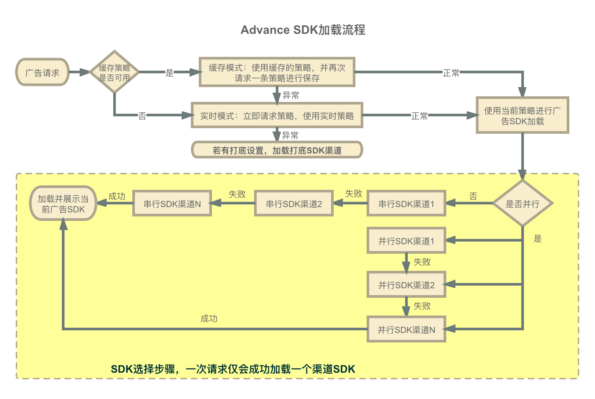

# Advance 聚合SDK对接文档-Android

<font size = "4">**版本号：v3.5.0**


## 1.集成须知

1. Advance 聚合SDK示例Demo	:

2. Advance 聚合SDK工作流程图示

3. 各个广告SDK平台聚合支持情况

	| 平台\广告位| 	开屏 |  激励视频 | 横幅（banner） | 插屏 | 信息流 | 全屏视频 | 自定义广告
|:------------- |:---------------|  :---------------|  :---------------|  :---------------|  :---------------|  :---------------|   :---------------|  
| Mercury |支持 |支持 |支持 |支持 |支持 | | 支持
| 穿山甲|支持 |支持(模板)  |支持(模板)  |支持(模板)  |支持(模板)  |支持(模板)  |支持
| 广点通  |支持 |支持 |支持(2.0) |支持(2.0) |支持(1.0、2.0) |支持(2.0) |支持
| 快手 |支持 |支持 | | | 支持 | 支持|支持
| 百度 |支持  |支持  |支持 ||| |支持 

4. SDK渠道平台信息：

	| SDK平台: | 	Mercury | 广点通 |  穿山甲 | 百度|快手| AdvanceSDK
|:------------- |:---------------|  :---------------|  :---------------|  :---------------|  :---------------|  :---------------|  
|集成后apk安装包增加大小 :|0.3M |1.4M | 1.8M|0.6M |1.1M | 0.1M
|兼容版本号:| v3.4.1 |  v4.330.1200 | v3.4.5.0 |  v5.96| v3.3.5.3| v3.5.0
|SDK ID 标识:| "1" |  "2"|  "3"|  "4"|  "5"| -


5. 文档中各位置初始化需要的**聚合广告位id**为Advance后台通过流量管理所创建

6. **策略最佳实践**说明
   
   一、 工具效果类APP：
   
   此类APP基本不存在CPT投放，建议 **使用缓存策略模式**，配置策略缓存时间>7天，缓存下加载策略仅**10ms左右**，非缓存平均**200ms左右**，缓存可以缩短单次广告请求整体耗时进而提升广告展示效果。
  
   
   二、 视频娱乐类APP、小而美APP最佳实践：
   
  此类APP可能会存在较多的CPT投放订单，建议**使用实时策略模式**，可根据运营情况，动态调整为缓存模式，建议缓存时间设置不超过3天。
   
  
7. **隐私政策**相关说明和建议：

	工信部191号文和337号明确了APP违规收集用户信息的认定方法，[点此查看细则](https://blog.csdn.net/t1996ys/article/details/109121933)，为防止媒体接入SDK中产生被判定违规行为，建议严格遵守以下方案：
	- APP自有隐私政策说明中一定要**标明委托AdvanceSDK收集使用个人信息的目的、方式、范围**等。[点此查看AdvanceSDK隐私政策说明](http://www.bayescom.com:81/privacy.html)
	- 在调用SDK加载广告方法之前，需要询问用户是否授权获取设备信息等隐私相关权限。**一定不要在询问的同时或者询问之前调用SDK加载广告方法**。


## 2.SDK引入

SDK引入主要有两种方式，一是通过线上gradle依赖引入，二是通过本地aar包引入；推荐使用gradle引入，如果gradle引入不成功可以联系我们提供本地aar来引入，引入参考如下：

APP项目目录下build.gradle配置参考：

**注意：** 渠道依赖包默认包含了当前兼容的各平台SDK的aar包，如果本地也有引入对应渠道aar请选择移除本地aar包或者使用不含aar包的渠道依赖包。

```groovy

dependencies {
	//必须，Advance聚合SDK 引入。如果gradle引入异常，请参考根目录gradle进行配置，如果依然无法引入，请联系我们使用本地aar引入。
    implementation 'com.advsdk:advance:3.4.4'
    //必须，MSA Android10以上设备唯一标识 OAID SDK 引入
    implementation 'com.advsdk:advance_oaid:1.0.25'
    //必须，mercury SDK 渠道依赖包 包含了广告aar以及渠道处理逻辑
    implementation 'com.advsdk:advance_mry:3.4.4_341_1'
    //穿山甲、广点通、百度SDK 渠道依赖包，包含了广告aar以及渠道处理逻辑(如果APP本地引入了平台SDK的aar，不希望使用带aar引入的advance渠道库，可以在版本号后面加上 _core 标识，这样就不会产生aar引入冲突了，但是请注意，非advance推荐版本可能会出现广告加载异常，一定要充分测试)
    implementation 'com.advsdk:advance_csj:3.4.4_3412'
    implementation 'com.advsdk:advance_gdt:3.4.4_4310'
    implementation 'com.advsdk:advance_bd:3.4.4_596'
    //快手SDK 渠道依赖包 仅包含了渠道处理逻辑
    implementation 'com.advsdk:advance_ks:3.4.4_3353_core'
    //快手SDK 渠道依赖包 仅包含了快手广告aar
    implementation 'com.advsdk:advance_kslib:3.4.4_3353'
}
```


项目根目录build.gradle配置参考：

```groovy
allprojects {
    repositories {
        //一定要引入此项，如果同时有引入了阿里云的代理仓库地址，尽量将jcenter() 放在最前面
        jcenter()
//    maven { url 'https://maven.aliyun.com/repository/public/' }
        maven { url 'http://maven.aliyun.com/nexus/content/groups/public/' }
        google()
    }
}
```


为了适配穿山甲SDK下载和安装相关功能，在工程中引用的包 `com.android.support:support-v4:24.2.0 `
使用24.2.0以及以上版本。


## 3.OAID说明

Mercury SDK 在Android10 以上设备需要OAID才能正常下发广告，OAID说明详见 [移动安全联盟 MSA 官网](https://msa-alliance.cn/col.jsp?id=120)。

获取方法：build.gradle中添加最新版本 OAID gradle依赖地址，或者本地引入OAID的aar包。  

额外说明：如果 OAID 包低于**1.0.22**版本或者  Mercury SDK低于 **3.3.0**版本，建议升级aar包版本。<br/>如果**坚持使用旧版本**，请**自己获取**到 OAID 后调用 `MercuryAD.setOAID(String oaid)`方法对 OAID 赋值。


## 4.AndroidManifest.xml配置

1.为防止项目构建时抛 `Manifest merger failed`异常，需要在AndroidManifest.xml中加入以下适配代码，兼容SDK引用版本。

```
<!-- 如果未引入快手，com.advance.supplier.ks可以不添加-->
<uses-sdk tools:overrideLibrary="com.bun.miitmdid,com.advance.supplier.ks,com.kwad.sdk" />
```

2. SDK包中已配置好需要的信息，无需注册广告相关的Activity和Service。如果本地已经引入了相同的配置代码，可能会报**AndroidManifest merge** 错误，可以参考报错的修改建议进行对应内容的**replace**操作即可。

 
## 5.代码混淆配置

SDK包中已经做了代码混淆配置，不需要额外的混淆配置。

## 6.广告位接入代码示例

详细处理代码可以参考AdvanceDemo工程。

### 初始化SDK

初始化操作一定要在广告请求之前进行，建议在Application的onCreate方法中进行初始化操作。：

```java
public class MyApplication extends Application {
    @Override
    public void onCreate() {
        super.onCreate();
        //Mercury预缓存配置，开启预缓存需要设置媒体id
        AdConfigManager.getInstance().setMediaId("100171");
        MercuryAD.needPreLoadMaterial(true);

        //聚合SDK初始化
        AdvanceConfig.getInstance()
                .setAppName("应用名称")//穿山甲必须：填入穿山甲平台创建媒体时的应用名称
                .setDebug(true)//可选：设置debug开发调试模式,tag为：Advance SDK
                .initSDKs(this);
    }
}
```


#### 初始化相关API说明：

| 方法名| 	方法介绍|  是否必须
|:------------- |:---------------|  :---------------|  
| initSDKs(Context context) |初始化SDK，主要是进行版本校验、oaid获取以及Mercury SDK初始化|必须
|setMercuryMediaId(String mercuryMediaId) |设置在聚合 SDK平台申请的媒体ID ，同时也是Mercury SDK的媒体ID |按需必填
|setMercuryMediaKey(String mercuryMediaKey)| 设置在聚合 SDK平台申请的媒体KEY，同时也是Mercury SDK的媒体Key |按需必填
|setCsjAppId(String csjAppId) |设置穿山甲平台申请的媒体ID|按需必填
|setAppName(String appName)|设置穿山甲平台申请的 媒体应用名称 |按需必填
|setGdtMediaId(String gdtMediaId)  |设置在广点通平台申请的媒体ID|按需必填
|setBdAppId(String bdAppId) |设置在百度百青藤平台申请的 媒体ID|按需必填
|setKsAppId(String ksAppId) |设置在快手平台申请应用的 媒体ID|按需必填
|setKsAppName(String ksAppName)|设置在快手平台申请应用的应用名称|可选参数
|setDefaultStrategyCacheTime(CacheMode defaultStrategyCacheTime) | 当启用策略缓存时才生效，设置默认的策略缓存时长，不设置默认使用CacheMode.DEFAULT。<br/> CacheMode.DEFAULT  默认的缓存时长，3天<br/> CacheMode.SHORT  较短的缓存时长，3天 <br/> CacheMode.WEEK  一周的缓存时长，7天<br/> CacheMode.MONTH  一月的缓存时长，30天 <br/> CacheMode.UNLIMIT  不限定缓存时间 <br/> ps.后台针对不同广告，会适当下发新的缓存时长，如果后台有下发SDK会选择使用下发的时长| 可选 
|setReportDelayTime(int reportDelayTime) | 设置广告上报的延迟时间，单位毫秒，最大值10000ms；默认-1不进行延迟  | 可选 
|clearCache(Context ctx) | 清除所有的策略缓存 | 可选 
|setNeedPermissionCheck(boolean needPermissionCheck)|穿山甲全局设置项 <br/> true 代表请求穿山甲广告前会进行权限检查和申请，默认false | 可选
|setSupportMultiProcess(boolean supportMultiProcess)  |穿山甲全局设置项  <br/> 是否支持多进程，true支持，默认true | 可选
|setCsjDirectDownloadNetworkType(int[] csjDirectDownloadNetworkType)  |穿山甲全局设置项 <br/> 设置穿山甲允许直接下载的网络状态集合，状态集合参考 TTAdConstant.NETWORK_STATE_XX | 可选
|setOaid(String oaid) <br/>MercuryAD.setOAID(String oaid) <br/>MercuryAD.setOAID(Context context, String oaid)|Mercury SDK 全局设置项  <br/> 设置Mercury SDK的OAID值，预留防止msa版本不一致导致获取不到OAID，导致填充低 |可选
|MercuryAD.optimizationPermissionRequest(boolean enable) <br/>MercuryAD.optimizationPermissionRequest(boolean enable, @ColorInt int actionBgColor, @ColorInt int actionTextColor) | Mercury SDK 全局设置项  <br/> 流程优化设置：是否启用优化权限申请功能，开启后将在动态权限申请时，提前一步告知权限使用目的。默认关闭 <br/> actionBgColor 代表底部按钮的背景色，<br/>actionTextColor 代表底部按钮的字体色| 可选
|MercuryAD.needPreLoadMaterial(boolean needPreLoadMaterial)  |Mercury SDK 设置是否允许预缓存素材，默认flase不预缓存|可选


### 6.1开屏广告(AdvanceSplash)

集成最佳实践：

- 广告时长 **5 秒**为宜；
- 展示区域最好**大于整体画面 75%且高度不得低于400dp**，全屏效果更佳；
- 开屏请求、展示时机：**使用单独的页面展示开屏**，且加载广告时尽量不要进行其他的网络请求或耗时操作，这类操作可以在广告曝光或加载失败回调事件以后再进行。
- Mercury开屏广告常见尺寸有两种比例：1）2:3 比例，多用尺寸为 640*960、1280x1920；2） 9:16 比例，多用尺寸为 720x1280、1080x1920;
- 由于平台实现差异性，**开屏跳转处理逻辑请严格参考demo中代码**，否则可能出现点击跳转异常


加载、展示广告核心方法，详细请参考demo中代码：


```java
//开屏初始化；adContainer为广告容器，skipView不需要自定义可以为null
advanceSplash = new AdvanceSplash(this,  "聚合splash广告位id", adContainer, skipView);
//必须：设置开屏核心回调事件的监听器。
advanceSplash.setAdListener(this);
//必须：请求策略并请求和展示广告，如果targetSDKVersion >= 23，需要申请好权限,如果您的App没有适配到Android6.0（即targetSDKVersion < 23）或者已经提前申请权限，那么只需要在这里直接调用loadAd方法。
advanceSplash.loadStrategy();
```

跳转首页处理参考：

```java
    /**
     * @param id 代表当前被选中的策略id，值为"1" 代表mercury策略 ，值为"2" 代表广点通策略， 值为"3" 代表穿山甲策略
     */
    @Override
    public void onSdkSelected(String id) {
        //给sdkId赋值用来判断被策略选中的是哪个SDK
        sdkId = id;
    }

    @Override
    public void onAdSkip() {
        new Handler(Looper.getMainLooper()).postDelayed(new Runnable() {
            @Override
            public void run() {
                next();
            }
        }, 100);
    }

    @Override
    public void onAdTimeOver() {
        new Handler(Looper.getMainLooper()).postDelayed(new Runnable() {
            @Override
            public void run() {
                next();
            }
        }, 100);
    }
    
  @Override
    protected void onPause() {
        super.onPause();
        // 穿山甲处理逻辑,h5类型的广告，跳转后返回不会回调onAdSkip或者onAdTimeOver，会导致无法跳转首页，需要在这里额外处理跳转逻辑
        canJump = TextUtils.equals(sdkId, "3");
    }

    @Override
    protected void onResume() {
        super.onResume();
        if (canJump) {
            next();
        }
        canJump = true;
    }

    /**
     * 设置一个变量来控制当前开屏页面是否可以跳转，当开屏广告为普链类广告时，点击会打开一个广告落地页，此时开发者还不能打开自己的App主页。当从广告落地页返回以后，
     * 才可以跳转到开发者自己的App主页；当开屏广告是App类广告时只会下载App。
     */
    private void next() {
        if (canJump) {
            goToMainActivity();
        } else {
            canJump = true;
        }
    }

    /**
     * 跳转到主页面
     */
    private void goToMainActivity() {
        Intent intent = new Intent(SplashActivity.this, SplashToMainActivity.class);
        intent.setFlags(Intent.FLAG_ACTIVITY_SINGLE_TOP);
        startActivity(intent);
        this.finish();
    }

```

#### 相关API说明：

| 方法名| 	方法介绍|  是否必须
|:------------- |:---------------|  :---------------|  
|AdvanceSplash(Activity activity, String adspotId, ViewGroup adContainer, TextView skipView) |开屏初始化方法，adspotId 为聚合广告位id同时也是Mercury 渠道的广告位id，adContainer为开屏页的展示根布局，skipView为跳过按钮的自定义view，传null代表不自定义，会使用默认的跳过按钮| 必须
|setAdListener(AdvanceSplashListener listener) | 设置开屏各个事件的回调监听器，具体回调含义参考下方AdvanceSplashListener 说明| 必须
|loadStrategy()| 加载广告策略，根据返回的渠道顺序进行请求并展示广告，注意最好是申请好权限以后再调用此方法。| 必须
|enableStrategyCache(boolean enableCache) | 是否开启策略缓存。注意这里缓存的是SDK的调度策略，而非缓存的广告信息。不设置默认关闭   | 可选，具体参考**1.6 最佳实践说明**
| setSkipText(String skipText) | 自定义跳过按钮的字体，不设置默认显示为："跳过 %d " ，%d为剩余秒数| 可选	
|以下为穿山甲 SDK 渠道特有设置
|setCsjAcceptedSize(int width, int height)|设置穿山甲广告图片偏好尺寸，单位px，不设置默认宽1080px 高1920px | 可选
|setCsjExpressViewAcceptedSize(float expressViewWidth, float expressViewHeight) |模板广告需要设置期望个性化模板广告的大小,单位dp,代码位是否属于个性化模板广告，请在穿山甲平台查看，不设置默认宽360dp，高640dp |  模板广告必须
|以下为Mercury SDK 渠道特有设置
|setLogoImage(Drawable logoImage)| 设置Mercury SDK 开屏底部logo图标 | 可选
|setHolderImage(Drawable holderImage)| 设置Mercury SDK 开屏展示占位图，当广告素材渲染中会展示此处设置的图片，不设置默认无占位 | 可选
|MercuryAD.setLargeADCutType(LargeADCutType largeADCutType) | 素材展示模式设置，不设置默认为LargeADCutType.DEFAULT 保持素材原始比例 |  可选
|MercuryAD.setSplashBackgroundColor(@ColorInt int color) | 设置开屏背景颜色，默认透明。| 可选
|MercuryAD.setSplashForceShowLogo(boolean forceShowLogo)  | 是否强制显示开屏logo，前提是设置了底部logo图标 ，默认关闭| 可选
|MercuryAD.setSplashForceLogoHeight(int forceLogoHeightDP) | 自定义强制显示的开屏logo高度，单位dp，默认-1不限制高度 | 可选
|MercuryAD.setSplashCountDownDuration(int duration) | 设置开屏倒计时时长，最低3s 最高10s| 可选
|MercuryAD.setRichSplashCountDown(boolean countDown) | 设置富媒体开屏是否进行倒计时 ，默认true| 可选
|MercuryAD.setSplashHolderShowMode(SplashHolderMode splashHolderShowMode) | 设置开屏占位图的渲染方式<br/> SplashHolderMode.DEFAULT 默认设置，使用imageView的 setBackground 方法进行图片的填充，不同手机下可能会有一点图片变形 <br/> SplashHolderMode.GlIDE 使用glide方式加载 | 可选
|以下为广点通 SDK 渠道特有设置
|setGdtSkipContainer(View gdtSkipContainer) | 设置广点通的跳过载体，传入一个默认可见view给广点通进行可见检查机制 |可选
|setGdtClickAsSkip(boolean gdtClickAsSkip) | 设置广点通的广告点击后是否以onAdSkip(跳过事件)来回调，适合跳过和倒计时结束处理逻辑不同时设置，处理逻辑相同请忽略。true 点击广点通广告关闭后回调onAdSkip，false 回调 onAdTimeOver；默认为false。| 跳过按钮有特殊处理逻辑时使用，无则忽略
|setGdtCustomSkipHide(boolean gdtCustomSkipHide) | 广点通自定义跳过是否提前隐藏，避免跳过按钮提前展示。| 可选
|setCsjTimeOutQuit(boolean csjTimeOutQuit)  | 穿山甲返回time out回调时，是否退出策略，true 退出false 继续加载下个策略，false。| 可选

* 开屏事件回调 **AdvanceSplashListener**


| 方法名| 	方法介绍|  
|:------------- |:---------------|  
|onAdLoaded()	|成功获取广告信息回调
|onAdShow()	|广告成功展示回调 
|onAdFailed(AdvanceError advanceError) 	|广告加载失败回调，此时关闭开屏跳转主页
|onAdClicked()|	广告被点击回调
|onAdSkip()|	用户跳过广告回调，此时关闭开屏跳转主页，注意处理不同渠道的跳转条件，详见demo
|onAdTimeOver()|	倒计时结束回调，此时关闭开屏跳转主页，注意处理不同渠道的跳转条件，详见demo
|onSdkSelected(String sdkID) | 当前选中的SDK渠道，sdkID对应 **1.4 SDK渠道平台信息**中的SDK ID


### 6.2横幅广告(AdvanceBanner)

集成最佳实践：

- 适用场景：一般会在 APP 页面的底部或中部呈现。
- 常见尺寸：640*100 是最常见的 Banner 尺寸。
- 穿山甲横幅在列表中展示存在异常，如果想在列表展示广告建议使用模板信息流方式接入，或者渠道中不配置穿山甲渠道。
- 如果banner放在有触摸交互的view中时，请确保非交互情况下`onInterceptTouchEvent`事件返回为`false`，否则会出现广告无法点击问题。
- 若开启了自动刷新，广告所在页面移除时，务必调用广告`destroy()`方法，移除广告资源


请求广告核心方法，详细请参考demo中代码：


```java
//rl是banner的父布局，用来展示广告
advanceBanner = new AdvanceBanner(this, rl, "聚合banner广告位id");
//推荐：核心事件监听回调
advanceBanner.setAdListener(this);
//必须：请求策略并请求和展示广告
advanceBanner.loadStrategy();
```

#### 相关API说明：

| 方法名| 	方法介绍|  是否必须
|:------------- |:---------------|  :---------------|  
|AdvanceBanner(Activity activity, ViewGroup adContainer, String adspotId) | 广告初始化方法，adContainer是广告的展示父布局，adspotId为聚合广告位id同时也是Mercury 渠道的广告位id | 必须
|setAdListener(AdvanceBannerListener listener) | 设置各个事件的回调监听器，具体回调含义参考下方AdvanceBannerListener 说明| 必须
|loadStrategy()| 加载广告策略，根据返回的渠道顺序进行请求并展示广告。| 必须
|destroy() | 销毁广告，页面销毁的时候要调用此方法 | 必须
|enableStrategyCache(boolean enableCache) | 是否开启策略缓存。注意这里缓存的是SDK的调度策略，而非缓存的广告信息。不设置默认关闭  <br/>后台广告位 |  可选，具体参考**1.6 最佳实践说明**
|setRefreshInterval(int refreshInterval) | 设置刷新间隔（单位秒），不设置默认不刷新| 可选
|setAdListener(AdvanceBannerListener listener) | 设置广告事件的回调监听 | 可选
|以下为穿山甲 SDK 渠道特有设置
|setCsjAcceptedSize(int width, int height)  | 设置穿山甲广告图片偏好尺寸，单位px，不设置默认宽640px，高100px | 可选
|setCsjExpressViewAcceptedSize(int width, int height)  | 模板广告需要设置期望个性化模板广告的大小,单位dp,代码位是否属于个性化模板广告，请在穿山甲平台查看，不设置默认宽640dp，高100dp | **模板广告必须**


* 事件回调 **AdvanceBannerListener**

| 方法名| 	方法介绍|  
|:------------- |:---------------|  
|onAdLoaded()	|成功获取广告信息回调
|onAdShow()	|广告成功展示回调 
|onAdFailed(AdvanceError advanceError) 	|广告加载失败回调
|onAdClicked()|	广告被点击回调
|onDislike()|	用户关闭广告回调
|onSdkSelected(String sdkID) | 当前选中的SDK渠道，sdkID对应 **1.4 SDK渠道平台信息**中的SDK ID


 
### 6.3插屏(AdvanceInterstitial)

 
集成最佳实践：

- 适用场景：一般暂停时（多见于视频类 APP 节目暂停）；页面间跳转、切换时（比如游戏类 APP 过关、工具类 APP 页面转换）；APP 退出时；返回上一级时等场景，均可适当植入插屏广告。
- 常见尺寸：插屏广告尺寸通常等于或大于手机屏幕的一半，多设计 600x600、600x500 等规格。
- 一些建议：不要突然展示广告，最好在用户完成应用内操作后自然而然的植入，比如游戏通关后、视频播放结束后；
无论是插屏广告植入场景，还是展示频次，媒体均需要反复测试，以达到最佳变现效果；
- 插屏支持提前加载广告（注意控制时机，不可过早提前），但要注意，一次展示需对应一个广告实例，切忌复用广告实例。


请求广告核心方法，详细请参考demo中代码：


```java
//初始化广告
advanceInterstitial = new AdvanceInterstitial(this, "聚合插屏广告位id");
//推荐：核心事件监听回调
advanceInterstitial.setAdListener(this);
//必须：请求策略并请求广告
advanceInterstitial.loadStrategy();
```

展示广告

```java
//广告加载成功回调
@Override
public void onAdReady() {
    //展示广告
    advanceInterstitial.show();
}
```

#### 相关API说明：

| 方法名| 	方法介绍|  是否必须
|:------------- |:---------------|  :---------------|  
| AdvanceInterstitial(Activity activity,String adspotId) | 广告初始化方法，adspotId为聚合广告位id同时也是Mercury 渠道的广告位id | 必须
|setAdListener(AdvanceInterstitialListener listener) | 设置各个事件的回调监听器，具体回调含义参考下方AdvanceInterstitialListener 说明| 可选
|loadStrategy()| 加载广告策略，根据返回的渠道顺序进行请求并展示广告。| 必须
|enableStrategyCache(boolean enableCache) | 是否开启策略缓存。注意这里缓存的是SDK的调度策略，而非缓存的广告信息。不设置默认关闭  <br/>后台广告位 |  可选，具体参考**1.6 最佳实践说明**
|setGdtMediaListener(UnifiedInterstitialMediaListener listener) | 广点通渠道特有设置，设置广点通的视频广告的播放回调。| 可选
|setCsjExpressViewAcceptedSize(float expressViewWidth, float expressViewHeight) |穿山甲渠道特有设置，期望模板广告view的size,单位dp。高度为0代表自适应，不设置默认宽高为300dp | 可选


* 事件回调 **AdvanceInterstitialListener**

| 方法名| 	方法介绍|  
|:------------- |:---------------|  
|onAdReady()	|成功获取广告信息回调，广告准备就绪
|onAdShow()	|广告成功展示回调 
|onAdFailed(AdvanceError advanceError) 	|广告加载失败回调
|onAdClicked()|	广告被点击回调
|onAdClose()|	用户关闭广告回调
|onSdkSelected(String sdkID) | 当前选中的SDK渠道，sdkID对应 **1.4 SDK渠道平台信息**中的SDK ID


### 6.4原生模板(AdvanceNativeExpress)


集成最佳实践：

- 适用场景：适用于有内容输出的 APP，比如新闻资讯类、视频类、音频类、社区类等，通常在内容流中或内容详情页中植入。
- 常见尺寸：1）16:9，其中 640x360 尺寸用的最多，其次为 1280x720；2）2:1，640x320 尺寸用的最多。
- 一些建议：广告（排版格式、图片尺寸、内容调性等）与 APP 整体协调统一；
在内容流中植入广告，需对广告展现位置、展现频次等反复测试，避免过度干扰的同时，确保高可见性和效果性。
- 建议广告承载布局高度自适应，如要设置固定高度须知：穿山甲模板有最低高度限制，已知为最低125dp，Mercury最低80dp，广点通最低约100dp。
- 支持提前加载广告（注意控制时机，不可过早提前），但要注意，一次展示需对应一个广告实例，切忌复用广告实例。
- RecyclerView中使用的话请参考示例工程中的NativeExpressRecyclerViewActivity，建议在列表中每5-10个条目展示一条广告。

请求广告核心方法，详细请参考demo中代码：


```java
//初始化广告
advanceNativeExpress = new AdvanceNativeExpress(this, "聚合模板信息流广告位id");
//推荐：核心事件监听回调
advanceNativeExpress.setAdListener(this);
//必须：请求策略并请求广告
advanceNativeExpress.loadStrategy();
```

展示广告

```java
//广告加载成功回调
@Override
public void onAdLoaded(List<AdvanceNativeExpressAdItem> list) {
    Toast.makeText(this, "广告加载成功", Toast.LENGTH_SHORT).show();
    Log.d("DEMO", "LOADED");
    if (null == list || list.isEmpty()) {
        Log.d("DEMO", "NO AD RESULT");
    } else {
        AdvanceNativeExpressAdItem advanceNativeExpressAdItem = list.get(0);
        container.removeAllViews();
        container.setVisibility(View.VISIBLE);

        container.addView(advanceNativeExpressAdItem.getExpressAdView());
        // 广告可见才会产生曝光，否则将无法产生收益。
        advanceNativeExpressAdItem.render();
    }
}
```


#### 相关API说明：

请求策略、加载广告相关API（AdvanceNativeExpress）

| 方法名| 	方法介绍|  是否必须
|:------------- |:---------------|  :---------------|  
| AdvanceNativeExpress(Activity activity,String adspotId) | 广告初始化方法，adspotId为聚合广告位id同时也是Mercury 渠道的广告位id | 必须
|setAdListener(AdvanceNativeExpressListener listener) | 设置各个事件的回调监听器，具体回调含义参考下方AdvanceNativeExpressListener 说明| 可选
|loadStrategy()| 加载广告策略，根据返回的渠道顺序进行请求并展示广告。| 必须
|enableStrategyCache(boolean enableCache) | 是否开启策略缓存。注意这里缓存的是SDK的调度策略，而非缓存的广告信息。不设置默认关闭  <br/>后台广告位 |  可选，具体参考**1.6 最佳实践说明**
|setExpressViewAcceptedSize(int width, int height)   | 设置期望的模板广告view的size,单位dp，同时适用于穿山甲、广点通、Mercury。不设置默认宽600dp 高0dp，**高度为0,代表自适应高度** | 可选
|setCsjImageAcceptedSize(int width, int height)  |穿山甲渠道特有设置，设置图片偏好尺寸，单位px，不设置默认宽640px  高320px | 可选
|setGdtFullWidth(boolean isFullWidth) | 广点通、Mercury 渠道特有设置，设置是否宽度占满，默认true | 可选
|setGdtAutoHeight(boolean isAutoHeight) | 广点通、Mercury 渠道特有设置，设置是否高度自适应，默认true | 可选
|setGdtMaxVideoDuration(int gdtMaxVideoDuration) | 广点通渠道特有设置，设置返回视频广告的最大视频时长（闭区间，可单独设置），单位:秒，合法输入为：5<=maxVideoDuration<=60. 此设置会影响广告填充，请谨慎设置，不设置默认60 | 可选

信息流子View相关API（AdvanceNativeExpressAdItem）

| 方法名| 	方法介绍
|:------------- |:---------------
|String getSdkId()   | 获取当前加载的SDK渠道，sdkID对应 **1.4 SDK渠道平台信息**中的SDK ID
| destroy() | 销毁当前展示的信息流子View以及资源占用回收
|View getExpressAdView() | 获取当前信息流的广告视图View 
|render() | 渲染视图


* 事件回调 **AdvanceNativeExpressListener**

| 方法名| 	方法介绍|  
|:------------- |:---------------|  
|onAdLoaded(List<AdvanceNativeExpressAdItem> list) |成功获取广告信息回调，广告准备就绪
|onAdFailed(AdvanceError advanceError)  | 获取广告信息失败回调
|onAdShow(View view) |  广告素材展示成功回调，view是当前展示成功的视图
|onAdRenderSuccess(View view)	|广告渲染成功回调，不一定曝光了 
|onAdRenderFailed(View view) |广告渲染失败回调
|onAdClicked(View view)|	广告被点击回调
|onAdClose(View view)|	用户关闭广告回调
|onSdkSelected(String sdkID) | 当前选中的SDK渠道，sdkID对应 **1.4 SDK渠道平台信息**中的SDK ID


### 6.5激励视频(RewardVideo)

集成最佳实践：

- 适用场景：激励视频广告在游戏 APP 使用较多，比如通关失败后通过观看激励视频广告，用户可获取复活机会。此外，一些非游戏类 APP，也可通过植入 5-15 秒（甚至更长）的激励视频广告，让用户通过主动观看来享受到一些福利奖励、付费功能/权限等——比如网盘类 APP 通过观看激励视频广告来获取空间；视频、音频、音乐类 APP 通过观看激励视频广告来获取视频/音频/音乐免费观看或收听特权；图片类 APP 通过观看激励视频广告来获取图片下载特权；阅读类 APP 通过观看激励视频广告来获取书籍/漫画阅读特权等。
- 常见尺寸：激励视频广告常见为竖屏，比例 9:16，尺寸 720x1280；也有些 APP 采用横版样式，比例 16:9，尺寸 1280x720。
- 一些建议：广告植入密度不要过于频繁，以免拉低媒体调性和用户好感度；
将广告植入在既能刺激用户主动观看，同时又兼顾不对用户正常使用体验产生影响的位置。
- 激励达成事件请在广告激励回调`onAdReward `中进行，穿山甲支持服务器回传激励达成事件，但其他平台均不支持。
- 支持提前加载广告（注意控制时机，不可过早提前），但要注意，一次展示需对应一个广告实例，切忌复用广告实例。


加载广告核心方法，详细请参考demo中代码：


```java
//初始化广告
advanceRewardVideo = new AdvanceRewardVideo(this,"聚合激励视频广告位id");
//如果穿山甲版本号大于3.2.5.1，模板广告需要设置期望个性化模板广告的大小,单位dp,激励视频场景，只要设置的值大于0即可
advanceRewardVideo.setCsjExpressSize(500,500);
//设置通用事件监听器
advanceRewardVideo.setAdListener(this);
//必须：请求策略并请求广告
advanceNativeExpress.loadStrategy();
```

展示广告，以下代码表示收到广告立即展示。也可以选择提前加载好再展示，但要注意激励视频有失效时间，且一次load 对应一次show。


```java
//广告加载成功回调
@Override
public void onAdLoaded(AdvanceRewardVideoItem advanceRewardVideoItem) {
    isReady = true;
    Log.d("DEMO", "LOADED");
    this.advanceRewardVideoItem = advanceRewardVideoItem;
    Toast.makeText(this, "广告加载成功", Toast.LENGTH_SHORT).show();
    //展示广告
    advanceRewardVideoItem.showAd();
}
```


#### 相关API说明：

请求策略、加载广告相关API（AdvanceRewardVideo）

| 方法名| 	方法介绍|  是否必须
|:------------- |:---------------|  :---------------|  
| AdvanceRewardVideo(Activity activity,String adspotId) | 广告初始化方法，adspotId为聚合广告位id同时也是Mercury 渠道的广告位id | 必须
|setAdListener(AdvanceRewardVideoListener listener) | 设置各个事件的回调监听器，具体回调含义参考下方AdvanceRewardVideoListener 说明| 可选
|loadStrategy()| 加载广告策略，根据返回的渠道顺序进行请求并展示广告。| 必须
|enableStrategyCache(boolean enableCache) | 是否开启策略缓存。注意这里缓存的是SDK的调度策略，而非缓存的广告信息。不设置默认关闭  <br/>后台广告位 |  可选，具体参考**1.6 最佳实践说明**
|setCsjImageAcceptedSize(int width, int height) | 穿山甲渠道特有设置，设置穿山甲广告图片偏好尺寸，单位px，不设置默认宽1080px，高1920px | 可选
|setCsjRewardName(String rewardName) |  穿山甲渠道特有设置，设置奖励的名称，不设置默认空字符串 | 可选
|setCsjRewardAmount(int rewardAmount) |  穿山甲渠道特有设置，设置奖励的数量，不设置默认1 | 可选
|setCsjUserId(String userId) | 穿山甲渠道特有设置，标识应用侧唯一用户；若非服务器回调模式或不需sdk透传可设置为空字符串，不设置默认空字符串  | 可选
|setOrientation(int orientation) | 穿山甲渠道特有设置，设置期望视频播放的方向，为TTAdConstant.HORIZONTAL或TTAdConstant.VERTICAL（默认值）  | 可选
|setCsjMediaExtra(String mediaExtra) | 穿山甲渠道特有设置，用户透传的信息，可不传，默认空字符串  | 可选
|setCsjExpressSize(int width, int height) | 模板广告需要设置期望个性化模板广告的大小，单位dp，只要设置的值大于0即可  | 可选，如果穿山甲版本号大于3.2.5.1为必须


* 事件回调 **AdvanceRewardVideoListener**

| 方法名| 	方法介绍|  
|:------------- |:---------------|  
|onAdLoaded(AdvanceRewardVideoItem advanceRewardVideoItem) |成功获取广告信息回调，广告准备就绪
|onAdFailed(AdvanceError advanceError)  | 获取广告信息失败回调
|onAdShow() |  激励视频页面展示成功回调
|onVideoCached()	|视频缓冲成功回调
|onVideoComplete() | 视频播放完成回调
|onAdClicked()|	广告被点击回调
|onAdClose()|	用户关闭广告回调
| onAdReward()|	激励发放回调
|onSdkSelected(String sdkID) | 当前选中的SDK渠道，sdkID对应 **1.4 SDK渠道平台信息**中的SDK ID


* 基础激励视频实现类 **AdvanceRewardVideoItem**

方法名| 	方法介绍|  
|:------------- |:---------------|  
|String getSdkId() | 获取当前加载的SDK渠道，sdkID对应 **1.4 SDK渠道平台信息**中的SDK ID
|showAd() | 展示当前激励视频广告

### 6.6 全屏视频(FullScreenVideo)

集成最佳实践：

- 使用场景基本类似激励视频，广告展示样式也和激励视频基本一致，区别是对于用户来说强制性更低，用户可以提前“跳过”广告。
- 支持提前加载广告（注意控制时机，不可过早提前），但要注意，一次展示需对应一个广告实例，切忌复用广告实例。
 

加载广告核心方法，详细请参考demo中代码：


```java
//初始化广告
advanceFullScreenVideo = new AdvanceFullScreenVideo(this, "聚合全屏视频广告位id");
//如果穿山甲版本号大于3.2.5.1，模板广告需要设置期望个性化模板广告的大小,单位dp,全屏视频场景，只要设置的值大于0即可
advanceFullScreenVideo.setCsjExpressSize(500,500);
//推荐：核心事件监听回调
advanceFullScreenVideo.setAdListener(this);
//必须：请求策略并请求广告
advanceNativeExpress.loadStrategy();
```

展示广告

```java
//广告加载成功回调
@Override
public void onAdLoaded(AdvanceFullScreenItem advanceFullScreenItem) {
    Log.d(TAG, "onAdLoaded");
    //展示广告
    advanceNativeExpress.showAd();
}
```


#### 相关API说明：

请求策略、加载广告相关API（AdvanceFullScreenVideo）

| 方法名| 	方法介绍|  是否必须
|:------------- |:---------------|  :---------------|  
| AdvanceRewardVideo(Activity activity,String adspotId) | 广告初始化方法，adspotId为聚合广告位id同时也是Mercury 渠道的广告位id | 必须
|setAdListener(AdvanceFullScreenVideoListener listener) | 设置各个事件的回调监听器，具体回调含义参考下方AdvanceFullScreenVideoListener 说明| 可选
|loadStrategy()| 加载广告策略，根据返回的渠道顺序进行请求并展示广告。| 必须
|enableStrategyCache(boolean enableCache) | 是否开启策略缓存。注意这里缓存的是SDK的调度策略，而非缓存的广告信息。不设置默认关闭  <br/>后台广告位 |  可选，具体参考**1.6 最佳实践说明**
|setGdtMediaListener(UnifiedInterstitialMediaListener mediaListener) | 广点通渠道特有设置， 设置广点通媒体播放状态监听| 可选
|setGdtVideoOption(VideoOption videoOption)| 广点通渠道特有设置，设置广点通视频播放策略| 可选
|setCsjExpressSize(int width, int height) | 模板广告需要设置期望个性化模板广告的大小，单位dp，只要设置的值大于0即可  | 可选，如果穿山甲版本号大于3.2.5.1为必须


* 事件回调 **AdvanceFullScreenVideoListener**

| 方法名| 	方法介绍|  
|:------------- |:---------------|  
|onAdLoaded(AdvanceFullScreenItem advanceFullScreenItem) |成功获取广告信息回调，广告准备就绪
|onAdFailed(AdvanceError advanceError)  | 获取广告信息失败回调
|onAdShow() |  视频页面展示成功回调
|onVideoCached()	|视频缓冲成功回调
|onVideoSkipped()	|视频跳过回调
|onVideoComplete() | 视频播放完成回调
|onAdClicked()|	广告被点击回调
|onAdClose()|	用户关闭广告回调
|onSdkSelected(String sdkID) | 当前选中的SDK渠道，sdkID对应 **1.4 SDK渠道平台信息**中的SDK ID

* 基础全屏视频实现类 **AdvanceFullScreenItem**

方法名| 	方法介绍|  
|:------------- |:---------------|  
|String getSdkId() | 获取当前加载的SDK渠道，sdkID对应 **1.4 SDK渠道平台信息**中的SDK ID
|showAd() | 展示当前激励视频广告


## 7.自定义广告

非自定义的各个广告位是由我们Advance SDK来默认实现了通用的需求，且广告位和SDK渠道位比较固定，比较适合希望快速实现的客户；自定义广告位是广告的具体实现和展示由客户端来决定，这样可以满足客户端的多样性需求，而Advance SDK主要来负责策略（使用哪个SDK加载广告的策略）的下发和数据统计上报，客户端需要适配开发，比较适合希望实现自渲染广告等多样性格式广告或者需要除 上面1.3表格中支持的渠道以外的需求。

目前自定义广告可以实现SDK渠道和广告位的自定义，但暂未开放给客户自己添加的权限，如果需要新增渠道或者广告位烦请联系我们。

 
### 7.1 原生自渲染广告自定义示例

#### 自定义原生自渲染广告初始化

和自定义开屏示例一样， 初始化`AdvanceCustomizeAd`后，策略加载成功回调中初始化各渠道adapter，并请求广告。

原生自渲染activity示例：

```
public class NativeCustomizeActivity extends Activity {

    AdvanceCustomizeAd nativeCustomizeAd;
    FrameLayout fl;
    String Tag = NativeCustomizeActivity.class.getSimpleName();

    @Override
    protected void onCreate(@Nullable Bundle savedInstanceState) {
        super.onCreate(savedInstanceState);
        setContentView(R.layout.activity_ad_container);
        fl = findViewById(R.id.fl_ad);

        //创建自己的自渲染广告位，第二个参数为后台申请的广告位id
        nativeCustomizeAd = new AdvanceCustomizeAd(this, "");
        //必须：设置广告载体
        nativeCustomizeAd.setSupplierListener(new AdvanceCustomizeSupplierListener() {
            @Override
            public void onSupplierFailed(AdvanceError advanceError)  {
                //一般是策略无填充，或者所有策略均加载失败时回调
                fl.removeAllViews();
            }

            @Override
            public void onSupplierSelected(SdkSupplier selectedSupplier) {
                //策略选择回调，可根据不同的渠道ID来加载各渠道广告
                switch (selectedSupplier.id) {
                    case AdvanceConfig.SDK_ID_CSJ:
                        new MyCsjNCAdapter(NativeCustomizeActivity.this, nativeCustomizeAd, selectedSupplier, fl).loadAd();
                        break;
                    case AdvanceConfig.SDK_ID_GDT:
                        new MyGdtNCAdapter(NativeCustomizeActivity.this, nativeCustomizeAd, selectedSupplier, fl).loadAd();
                        break;
                    case AdvanceConfig.SDK_ID_MERCURY:
                        new MyMercuryNCAdapter(NativeCustomizeActivity.this, nativeCustomizeAd, selectedSupplier, fl).loadAd();
                        break;
                    default:
                        //不需要支持的渠道，建议选择重新调度策略
                        nativeCustomizeAd.selectSdkSupplier();
                }
            }
        });
//        发起策略请求
        nativeCustomizeAd.loadStrategy();
    }


}
```

#### 设置各个渠道的adapter

渠道adapter来负责各个渠道的广告加载流程，这里以穿山甲渠道`MyCsjNCAdapter`的实现为例，其他渠道请下载demo工程参考具体的实现。

<font size = "2">**注意**：一定要按照示例调用customizeAd 的对应事件方法

```

public class MyCsjNCAdapter implements TTAdNative.FeedAdListener {

    private Activity activity;
    private SdkSupplier sdkSupplier;
    private AdvanceCustomizeAd customizeAd;
    private ViewGroup adContainer;

    public MyCsjNCAdapter(Activity activity, AdvanceCustomizeAd customizeAd, SdkSupplier sdkSupplier, ViewGroup adContainer) {
        this.activity = activity;
        this.customizeAd = customizeAd;
        this.sdkSupplier = sdkSupplier;
        this.adContainer = adContainer;
    }

    public void loadAd() {
        //初始化advance默认的穿山甲配置，也可以自己选择初始化方式
        AdvanceUtil.initCsj(activity, sdkSupplier.mediaid);

        TTAdManager ttAdManager = TTAdSdk.getAdManager();
        if (AdvanceConfig.getInstance().isNeedPermissionCheck()) {
            ttAdManager.requestPermissionIfNecessary(activity);
        }
        TTAdNative ttAdNative = ttAdManager.createAdNative(activity);
        //step3:(可选，强烈建议在合适的时机调用):申请部分权限，如read_phone_state,防止获取不了imei时候，下载类广告没有填充的问题。
        ttAdManager.requestPermissionIfNecessary(activity);
        //step4:创建feed广告请求类型参数AdSlot,具体参数含义参考文档
        AdSlot adSlot = new AdSlot.Builder()
                // 必选参数 设置您的CodeId
                .setCodeId(sdkSupplier.adspotid)
                // 必选参数 设置广告图片的最大尺寸及期望的图片宽高比，单位Px
                .setImageAcceptedSize(640, 320)
                // 可选参数 设置是否支持deeplink
                .setSupportDeepLink(true)
                .setAdCount(sdkSupplier.adCount) //请求广告数量为1到3条
                .build();
        ttAdNative.loadFeedAd(adSlot, this);
    }

    @Override
    public void onError(int code, String message) {
        //这里一定要调用customizeAd 的事件方法
        if (customizeAd != null)
            customizeAd.adapterDidFailed(AdvanceError.parseErr(code, message));
    }


    @Override
    public void onFeedAdLoad(List<TTFeedAd> ads) {
        if (ads == null || ads.isEmpty()) {
            //这里一定要调用customizeAd 的事件方法
            if (customizeAd != null)
                customizeAd.adapterDidFailed(AdvanceError.parseErr(ERROR_DATA_NULL));
        } else {
            //这里一定要调用customizeAd 的事件方法
            if (customizeAd != null)
                customizeAd.adapterDidSucceed();

            CsjAdData advanceNativeAdData = new CsjAdData(ads.get(0));
            advanceNativeAdData.showAd();
        }
    }

    class CsjAdData {
        private View adView;
        TTFeedAd ad;

        ImageView mIcon;
        ImageView mDislike;
        Button mCreativeButton;
        TextView mTitle;
        TextView mDescription;
        TextView mSource;

        ImageView mGroupImage1;
        ImageView mGroupImage2;
        ImageView mGroupImage3;
        LinearLayout mGroupContainer;

        private FrameLayout videoLayout;
        private ImageView mImagePoster;
        private ImageView mSmallImagePoster;
        private LinearLayout nativeContainer;
        private Map<CsjAdData, TTAppDownloadListener> mTTAppDownloadListenerMap = new WeakHashMap<>();
        String TAG = "CsjAdData";

        public CsjAdData(TTFeedAd adData) {
            this.ad = adData;

            try {
                //小图布局不太一样
                if (ad.getImageMode() == TTAdConstant.IMAGE_MODE_SMALL_IMG) {
                    adView = LayoutInflater.from(activity).inflate(R.layout.csj_nc_layout_small, null, false);
                } else {
                    adView = LayoutInflater.from(activity).inflate(R.layout.csj_nc_layout, null, false);
                }
                initViews();
            } catch (Exception e) {
                e.printStackTrace();
                //这里一定要调用customizeAd 的事件方法
                if (customizeAd != null)
                    customizeAd.adapterDidFailed(AdvanceError.parseErr(ERROR_EXCEPTION_LOAD));
            }
        }

        private void initViews() {
            mIcon = adView.findViewById(R.id.iv_nc_icon);
            mDislike = adView.findViewById(R.id.iv_nc_dislike);
            mCreativeButton = adView.findViewById(R.id.btn_nc_creative);
            mTitle = adView.findViewById(R.id.tv_nc_ad_title);
            mDescription = adView.findViewById(R.id.tv_nc_ad_desc);
            mSource = adView.findViewById(R.id.tv_nc_ad_source);


            nativeContainer = adView.findViewById(R.id.native_ad_container);

            if (ad.getImageMode() == TTAdConstant.IMAGE_MODE_SMALL_IMG) {
                mSmallImagePoster = adView.findViewById(R.id.iv_nc_small_image);
            } else {
                mGroupContainer = adView.findViewById(R.id.native_3img);
                mGroupImage1 = adView.findViewById(R.id.img_1);
                mGroupImage2 = adView.findViewById(R.id.img_2);
                mGroupImage3 = adView.findViewById(R.id.img_3);

                videoLayout = adView.findViewById(R.id.iv_nc_video);
                mImagePoster = adView.findViewById(R.id.img_poster);
            }

        }

        public void showAd() {
            try {
                if (adContainer == null) {
                    Log.e(TAG, "广告位载体为空，请检查载体设置");
                    return;
                }
                adContainer.removeAllViews();
                //设置dislike弹窗，这里展示自定义的dialog
                bindDislikeCustom(ad);

                bindData(ad);
                adContainer.addView(adView);

            } catch (Exception e) {
                e.printStackTrace();
                //这里一定要调用customizeAd 的事件方法
                if (customizeAd != null)
                    customizeAd.adapterDidFailed(AdvanceError.parseErr(ERROR_EXCEPTION_SHOW));
            }
        }

        private void bindData(TTFeedAd ad) {
            //可以被点击的view, 也可以把adView放进来意味整个布局可被点击
            List<View> clickViewList = new ArrayList<>();
            clickViewList.add(adView);
            //触发创意广告的view（点击下载或拨打电话）
            List<View> creativeViewList = new ArrayList<>();
            creativeViewList.add(mCreativeButton);
            //如果需要点击图文区域也能进行下载或者拨打电话动作，请将图文区域的view传入
//            creativeViewList.add(convertView);
            //重要! 这个涉及到广告计费，必须正确调用。convertView必须使用ViewGroup。
            ad.registerViewForInteraction((ViewGroup) adView, clickViewList, creativeViewList, new TTNativeAd.AdInteractionListener() {
                @Override
                public void onAdClicked(View view, TTNativeAd ad) {
                    //这里一定要调用customizeAd 的事件方法
                    if (customizeAd != null)
                        customizeAd.adapterDidClicked();
                }

                @Override
                public void onAdCreativeClick(View view, TTNativeAd ad) {
                    //这里一定要调用customizeAd 的事件方法
                    if (customizeAd != null)
                        customizeAd.adapterDidClicked();
                }

                @Override
                public void onAdShow(TTNativeAd ad) {
                    //这里一定要调用customizeAd 的事件方法
                    if (customizeAd != null)
                        customizeAd.adapterDidShow();
                }
            });
            mTitle.setText(ad.getTitle()); //title为广告的简单信息提示
            mDescription.setText(ad.getDescription()); //description为广告的较长的说明
            mSource.setText(ad.getSource() == null ? "广告来源" : ad.getSource());
            TTImage icon = ad.getIcon();
            if (icon != null && icon.isValid()) {
                Glide.with(activity).load(icon.getImageUrl()).into(mIcon);
            }

            switch (ad.getImageMode()) {
                case TTAdConstant.IMAGE_MODE_SMALL_IMG:
                    if (ad.getImageList() != null && !ad.getImageList().isEmpty()) {
                        TTImage image = ad.getImageList().get(0);
                        if (image != null && image.isValid()) {
                            Glide.with(activity).load(image.getImageUrl()).into(mSmallImagePoster);
                        }
                    }

                    break;
                case TTAdConstant.IMAGE_MODE_LARGE_IMG:
                case TTAdConstant.IMAGE_MODE_VERTICAL_IMG:
                    if (ad.getImageList() != null && !ad.getImageList().isEmpty()) {
                        TTImage image = ad.getImageList().get(0);
                        if (image != null && image.isValid()) {
                            Glide.with(activity).load(image.getImageUrl()).into(mImagePoster);
                        }
                    }

                    mImagePoster.setVisibility(View.VISIBLE);
                    videoLayout.setVisibility(View.GONE);
                    mGroupContainer.setVisibility(View.GONE);
                    break;
                case TTAdConstant.IMAGE_MODE_VIDEO:

                    videoLayout.setVisibility(View.VISIBLE);
                    mGroupContainer.setVisibility(View.GONE);
                    mImagePoster.setVisibility(View.GONE);
                    //视频广告设置播放状态回调（可选）
                    ad.setVideoAdListener(new TTFeedAd.VideoAdListener() {
                        @Override
                        public void onVideoLoad(TTFeedAd ad) {

                        }

                        @Override
                        public void onVideoError(int errorCode, int extraCode) {

                        }

                        @Override
                        public void onVideoAdStartPlay(TTFeedAd ad) {

                        }

                        @Override
                        public void onVideoAdPaused(TTFeedAd ad) {

                        }

                        @Override
                        public void onVideoAdContinuePlay(TTFeedAd ad) {

                        }

                        @Override
                        public void onProgressUpdate(long current, long duration) {
                            Log.e("VideoAdListener", "===onProgressUpdate current:" + current + " duration:" + duration);
                        }

                        @Override
                        public void onVideoAdComplete(TTFeedAd ad) {
                            Log.e("VideoAdListener", "===onVideoAdComplete");
                        }
                    });
                    if (videoLayout != null) {
                        View video = ad.getAdView();
                        if (video != null) {
                            if (video.getParent() == null) {
                                videoLayout.removeAllViews();
                                videoLayout.addView(video);
                            }
                        }
                    }
                    break;
                case TTAdConstant.IMAGE_MODE_GROUP_IMG:
                    if (ad.getImageList() != null && ad.getImageList().size() >= 3) {
                        TTImage image1 = ad.getImageList().get(0);
                        TTImage image2 = ad.getImageList().get(1);
                        TTImage image3 = ad.getImageList().get(2);
                        if (image1 != null && image1.isValid()) {
                            Glide.with(activity).load(image1.getImageUrl()).into(mGroupImage1);
                        }
                        if (image2 != null && image2.isValid()) {
                            Glide.with(activity).load(image2.getImageUrl()).into(mGroupImage2);
                        }
                        if (image3 != null && image3.isValid()) {
                            Glide.with(activity).load(image3.getImageUrl()).into(mGroupImage3);
                        }

                        mGroupContainer.setVisibility(View.VISIBLE);
                        videoLayout.setVisibility(View.GONE);
                        mImagePoster.setVisibility(View.GONE);
                    }
                    break;
            }

            switch (ad.getInteractionType()) {
                case TTAdConstant.INTERACTION_TYPE_DOWNLOAD:
                    //如果初始化ttAdManager.createAdNative(getApplicationContext())没有传入activity 则需要在此传activity，否则影响使用Dislike逻辑
                    ad.setActivityForDownloadApp(activity);
                    mCreativeButton.setVisibility(View.VISIBLE);
                    bindDownloadListener(mCreativeButton, ad);
                    break;
                case TTAdConstant.INTERACTION_TYPE_DIAL:
                    mCreativeButton.setVisibility(View.VISIBLE);
                    mCreativeButton.setText("立即拨打");
                    break;
                case TTAdConstant.INTERACTION_TYPE_LANDING_PAGE:
                case TTAdConstant.INTERACTION_TYPE_BROWSER:
                    mCreativeButton.setVisibility(View.VISIBLE);
                    mCreativeButton.setText("查看详情");
                    break;
                default://                    交互类型异常
                    mCreativeButton.setVisibility(View.GONE);
            }


        }

        private void bindDislikeCustom(TTFeedAd ad) {
            List<FilterWord> words = ad.getFilterWords();
            if (words == null || words.isEmpty()) {
                return;
            }

            final DislikeDialog dislikeDialog = new DislikeDialog(activity, words);
            dislikeDialog.setOnDislikeItemClick(new DislikeDialog.OnDislikeItemClick() {
                @Override
                public void onItemClick(FilterWord filterWord) {
                    //布局清除
                    if (adContainer != null)
                        adContainer.removeAllViews();
                }
            });
            final TTAdDislike ttAdDislike = ad.getDislikeDialog(dislikeDialog);

            mDislike.setOnClickListener(new View.OnClickListener() {
                @Override
                public void onClick(View v) {
                    //展示dislike可以自行调用dialog
                    dislikeDialog.show();

                    //也可以使用接口来展示
                    //ttAdDislike.showDislikeDialog();
                }
            });
        }

        private void bindDownloadListener(final Button adCreativeButton, TTFeedAd ad) {
            TTAppDownloadListener downloadListener = new TTAppDownloadListener() {
                @Override
                public void onIdle() {
                    if (!isValid()) {
                        return;
                    }
                    adCreativeButton.setText("开始下载");

                }

                @SuppressLint("SetTextI18n")
                @Override
                public void onDownloadActive(long totalBytes, long currBytes, String fileName, String appName) {
                    if (!isValid()) {
                        return;
                    }
                    if (totalBytes <= 0L) {
                        adCreativeButton.setText("0%");
                    } else {
                        adCreativeButton.setText((currBytes * 100 / totalBytes) + "%");
                    }

                }

                @SuppressLint("SetTextI18n")
                @Override
                public void onDownloadPaused(long totalBytes, long currBytes, String fileName, String appName) {
                    if (!isValid()) {
                        return;
                    }
                    if (totalBytes <= 0L) {
                        adCreativeButton.setText("0%");
                    } else {
                        adCreativeButton.setText((currBytes * 100 / totalBytes) + "%");
                    }

                }

                @Override
                public void onDownloadFailed(long totalBytes, long currBytes, String fileName, String appName) {
                    if (!isValid()) {
                        return;
                    }
                    adCreativeButton.setText("重新下载");

                }

                @Override
                public void onInstalled(String fileName, String appName) {
                    if (!isValid()) {
                        return;
                    }
                    adCreativeButton.setText("点击打开");

                }

                @Override
                public void onDownloadFinished(long totalBytes, String fileName, String appName) {
                    if (!isValid()) {
                        return;
                    }
                    adCreativeButton.setText("点击安装");

                }

                @SuppressWarnings("BooleanMethodIsAlwaysInverted")
                private boolean isValid() {
                    return mTTAppDownloadListenerMap.get(CsjAdData.this) == this;
                }
            };
            //一个ViewHolder对应一个downloadListener, isValid判断当前ViewHolder绑定的listener是不是自己
            ad.setDownloadListener(downloadListener); // 注册下载监听器
            mTTAppDownloadListenerMap.put(CsjAdData.this, downloadListener);
        }

    }
}

```

###  7.2 其他自定义广告

自定义开屏和自定义自渲染原理类似，具体代码请参考最新demo中的`CustomSplashActivity`类文件。

自定义激励视频和自定义自渲染原理类似，具体代码请参考最新demo中的`CustomRewardActivity`类文件。

自定义横幅广告和自定义自渲染原理类似，具体代码请参考最新demo中的`CustomBannerActivity`类文件。

自定义插屏广告和自定义自渲染原理类似，具体代码请参考最新demo中的`CustomInterstitialActivity`类文件。

自定义模板信息流广告自定义自渲染原理类似，具体代码请参考最新demo中的`CustomNativeExpressListActivity`类文件。

自定义全屏视频广告自定义自渲染原理类似，具体代码请参考最新demo中的`CustomFullScreenActivity`类文件。

 
### 7.3 自定义广告注意事项

* 1.确保广告各个展示周期（加载、展示、点击、失败）的事件上报正常，调用方法分别是 adapterDidSucceed()，adapterDidShow()， adapterDidClicked()，adapterDidFailed()。

* 2.在自定义渠道信息时，如果`selectedSupplier`返回了未实现的渠道id（即不可用渠道），需要调用`AdvanceCustomizeAd.selectSdkSupplier()`重启策略选择方法，寻找下一个可用的SDK渠道策略。
* 3.自定义广告当前仅支持串行加载，暂不支持SDK并行


## 8.异常处理

### 8.1 debug日志排查

如果集成完成，需要调试sdk请务必在**SDK初始化配置时打开debug模式**, 或者直接在需要debug的地方调用：

	AdvanceConfig.getInstance().setDebug(true)
	
然后在` Android Studio`  中的 ` Logcat` 下搜索 **advance** 关键字，即可查看SDK中所有的打印日志。

<font size=2>注： 部分手机需要在开发者选项打开日志打印开关，部分华为手机需要系统设置中开启日志打印，如果无法打印请先确认手机系统设置是否正常。</font>

	
### 8.2 Advance SDK错误码

* com.advance.model.AdvanceError 异常信息包装类

|错误码 	  | 错误详情 | 排查方向
|:------------- |:---------------|  :---------------|  
|9901| 数据为空 |广告返回的数据为空，一般为渠道广告无填充。
|9902 | 加载某个SDK渠道时发生异常| 查看logcat下日志输出，寻找具体原因
|9903 |展示某个SDK渠道时发生异常| 查看logcat下日志输出，寻找具体原因
|9904|渲染某个SDK渠道时发生异常| 查看logcat下日志输出，寻找具体原因
|9905|当前策略中无有效的SDK渠道，或渠道信息为空 | 检查聚合后台中对应广告位的渠道设置，有可能是配错渠道或者没有配置
|9906| 策略调度时发生异常 | 查看logcat下日志输出，及时反馈我们帮助排查
|9907|未获取到策略 |首先检查网络是否正常，若网络正常请检查聚合后台广告位状态是否正常，以及广告位配置是否正确，若全部配置正常，依然报此问题，请联系我们
|9908|某个SDK渠道启动异常| 查看logcat下日志输出，及时反馈我们帮助排查
|9909|穿山甲渠道SDK超时且不再加载优先级更低的渠道 | 加载超时，检查网络是否正常。仅开屏中会出现，代表开屏广告位中配置了setCsjTimeOutQuit(true)，低频可忽略
|9910 | 穿山甲渠道SDK加载超时 | 加载超时，检查网络是否正常
|9911 | 百度SDK加载失败 | 查看logcat下日志输出，寻找具体原因
|9912 | 快手SDK加载失败，广告位id类型转换异常 | 一般是广告位转换出错，检查后台配置的快手渠道下广告位id是否为纯数字，非纯数字会引起该异常。
|99_XXX | 某个SDK渠道返回的错误，其中XXX为该SDK渠道返回的具体错误码 | 翻阅各个平台下的错误码说明查找具体原因： <br/>穿山甲：[错误码说明，点击跳转](https://www.pangle.cn/union/media/union/download/detail?id=4&docId=5de8d9b925b16b00113af0ed&osType=android)<br/>广点通：[错误码说明，点击跳转](https://developers.adnet.qq.com/doc/android/union/union_debug#sdk%20%E9%94%99%E8%AF%AF%E7%A0%81)<br/>百度：[接入文档，点击跳转；错误码详见17.2](https://union.baidu.com/miniappblog/2020/06/16/AndroidSDK/) <br/>快手：无在线文档，[点击下载离线文档，查看详细错误信息](https://static.yximgs.com/udata/pkg/KS-Android-KSAdSDk/kssdk-ad-3.3.5.3-publishRelease-6d3b66a-167.zip)

### 8.3 其他异常处理

Q: 项目构建时出现 “unexpected element < queries> found in < manifest>”异常?

A: queries是Android11新引入的manifest基础成分，低版本的gradle无法识别，[点此查看详细说明](https://stackoverflow.com/questions/62969917/how-do-i-fix-unexpected-element-queries-found-in-manifest)。需要升级Android Gradle Plugin 到以下版本：
 
- 3.3.3
- 3.4.3
- 3.5.4
- 3.6.4
- 4.0.1

---

Q: 请求不到广告怎么办？

A: 首先检查广告的ID配置是否正确，如果ID正确，根据SDK返回的异常code和msg，翻阅上面 **8.2 SDK错误码**来分析错误原因。

---


## 9 测试验收

为保证对接无误，接入完成并自测后，建议您提供测试包给我方对接人员进行验收。
